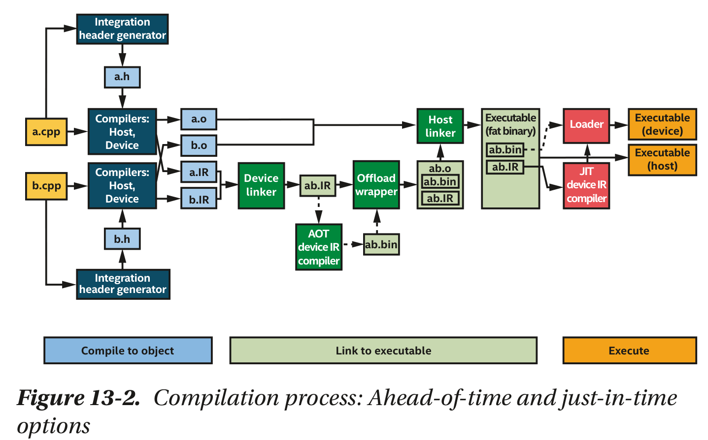
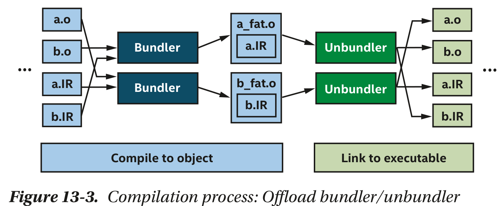

# データ並列C++

## SYCL
Khronosが標準化を進めているC++のヘテロジニアス・データ並列処理プログラミングモデル
- ロイヤルフリー
- クロスプラットフォーム
  - マルチベンダー
  - マルチアーキテクチャ
- 単一のソースで異なるプロセッサを扱う

- [SYCL* でヘテロジニアス・プログラミングの課題を解決する](https://www.isus.jp/products/oneapi/solving-heterogeneous-programming-challenges-with-sycl/)
- [SYCL* を使用すべき理由](https://www.isus.jp/products/oneapi/why-sycl-elephants-in-the-sycl-room/)

## GPU専用プログラミング?
- 今後どのような専用アクセラレータがでるかは分からない
- GPUに限定されない
- SYCLは共通コードと特殊コードを使い分けることで幅広いアクセラレータに対応する
  - SPMD(Single Program Multiple Data)というプログラミングモデル
  - NVIDIA CUDA/OpenCLなどで有用という実績

### CUDAを使えばよいのでは?
- CUDAの仕様・実装はNVIDIAが管理している
- NVIDIA GPUでしか使えないというライセンス

### OpenCLを使えばよいのでは?
- OpenCLはCUDAやSYCLよりもソフトウェア・スタックの低層で提供される
- SYCLはC++抽象化によりOpenCLの利点をより生産性高く利用できる

### C++を使えばよいのでは?
- 現行の規格はまだまだ不十分
- 後方互換性維持のため進捗が遅い

### SYCLはオープンなの?
Apple, Codeplay, Intelなどが貢献している

などと主張している

### queue
一つのデバイスへの接続
- ランタイムが選ぶデフォルトデバイス
- 特定のデバイス(CPU, GPU, FPGA)
- 追加のヒント
- 利用可能なものをリストアップ

```cpp
// デフォルトのセレクターを使用する
queue q1{}; // default_selector
queue q2{default_selector()};

// CPU を使用する
queue q3{cpu_selector()};

// GPU を使用する
queue q4{gpu_selector()};

// 追加のヒントを指定する
queue q6{aspect_selector(std::vector{aspect::fp16, aspect::usm_device_allocations})};

// 関数を記述して、より複雑な選択を使用する
queue q5{my_custom_selector(a, b, c)};
```

### queue.submit
ワーク(カーネルコード)を投入
- 実行順序はランタイムに任せる
- 順序を指定することも可能

```cpp
// queue.submit コード
q.submit([&](handler &h) {
    h.parallel_for(num_items,
        [=](auto i) { sum[i] = a[i] + b[i]; }
    );
});

// ショートバージョン
q.parallel_for(num_items,
    [=](auto i) { sum[i] = a[i] + b[i]; }
);
```

## DPC++(data parallel C++)
- Intelのオープンソースプロジェクト
  - 他にComputeCpp(Codeplay), triSYCL(AMD/Xilinx), hipSYCL(ハイデルベク大学), neoSYCL(NEC)などがある
  - 
- LLVMとoneAPIによるSYCLの実装
  - [Intel oneAPI DPC++コンパイラ](https://www.intel.com/content/www/us/en/developer/tools/oneapi/dpc-compiler.html)

DPC++ = C++ + SYCL + SYCLの拡張

## 参考
- [SYCL 2020](https://www.isus.jp/wp-content/uploads/pdf/sycl-2020_JA.pdf)
- [oneAPI GPU 最適化ガイド](https://www.isus.jp/wp-content/uploads/pdf/oneapi-gpu-optimization-guide_JA.pdf)
- [Data Parallel C++](https://link.springer.com/book/10.1007/978-1-4842-5574-2)

サンプル
```cpp
#include <CL/sycl.hpp>
int main()
{
  constexpr size_t N = 16;
  int data[N];
  sycl::buffer<int, 1> data_buf(data, N); // バッファ
  auto device_selector = sycl::default_selector{};
  sycl::queue q(device_selector); // デバイスセレクト
  q.submit([&](sycl::handler &h){ // キューにコマンドを送信
    sycl::accessor data_acc(data_buf, h);

    h.parallel_for(N, [=](auto id){
      data_acc[id] = id; // このコードがアクセラレータ上で実行される
    });

  });
  {
    sycl::host_accessor host_acc(data_buf);
    std::copy_n(
      host_acc.get_pointer(), N - 1,
      std::ostream_iterator<int>(std::cout, ", ")
    );
    std::cout << host_acc.get_pointer()[N-1] << std::endl;
  }
}
```

## SYCL概要
[インテルのサンプルを使用して DPC++ を開始する](https://www.isus.jp/products/oneapi/explore-dpcpp-samples/)
### プラットフォーム・モデル
- 利用可能なデバイスを抽象化(sycl::device)
  - デバイスを扱うsycl::queue
### カーネル実行モデル
- コマンドグループとカーネル(コード)を記述してqueueに渡す
- [C++のparallel API](https://cpprefjp.github.io/reference/execution/execution/execution_policy.html)を拡張

```cpp
for(int i=0; i < n; i++){
  a[i] = b[i] + c[i];
}
```

```cpp
// 標準C++
#include <iostream>
#include <algorithm>
#include <execution>
#include <vector>

int main()
{
  std::vector<int> v = {3, 1, 4, 5, 2, 6};

  // これまで通りの逐次実行
  std::sort(v.begin(), v.end());
  std::sort(std::execution::seq, v.begin(), v.end());

  // 並列実行
  std::sort(std::execution::par, v.begin(), v.end());

  // 並列化・ベクトル化
  std::sort(std::execution::par_unseq, v.begin(), v.end());

  // ベクトル化
  std::sort(std::execution::unseq, v.begin(), v.end());
}
```

```cpp
// SYCL
h.parallel_for(sycl::range{n}, [=](id<1> i){
  a[i] = b[i] + c[i];
});
```

### ND-rangeカーネル
空間を小さいワークグループに分割してそれぞれのグループを並列処理する


```cpp
q.parallel_for(sycl::nd_range{{n}, {m}}, [=](auto item){
  ...
});
```

## メモリモデル
- 統合共有メモリUSM(Unified shared memory)
  - ホストでもつかデバイスで持つか共有するか
  - 明示的にデータ移動を指示するか暗黙的に行われるか
- バッファメモリモデル
  - アクセッサクラスを用いてSYCLカーネルからアクセスされる共有配列

```cpp
// USM
queue q;
auto data = malloc_shared<int>(N, q);
for(int i = 0;i < N; i++) data[i] = i;

q.parallel_for(N, [=](auto i){
  data[i]++;
}).wait();

for(int i = 0;i < N; i++) printf("%d ", i);
free(data, q);
```

## USBの明示的なデータ移動

```cpp
#include <CL/sycl.hpp>
#include<array>

using namespace sycl;
constexpr int N = 42;

int main() {
  queue Q;
  std::array<int,N> host_array;
  int *device_array = malloc_device<int>(N, Q);  // デバイスにメモリ確保
  for (int i = 0; i < N; i++) host_array[i] = i; // ホストのメモリ

  // ホストからデバイスにコピー
  Q.submit([&](handler &h) {
    h.memcpy(device_array, &host_array[0], N * sizeof(int));
  }).wait();

  // デバイスで計算
  Q.submit([&](handler &h) {
    h.parallel_for(N, [=](id<1> i) { device_array[i]++; });
  }).wait();

  // デバイスからホストにコピー
  Q.submit([&](handler &h) {
    h.memcpy(&host_array[0], device_array, N * sizeof(int));
  }).wait();
  free(device_array, Q);
}
```

## USBの暗黙のデータ移動

```cpp
#include <CL/sycl.hpp>
using namespace sycl;
constexpr int N = 42;

int main() {
  queue Q;
  int *host_array = malloc_host<int>(N, Q);
  int *shared_array = malloc_shared<int>(N, Q);

  for (int i = 0; i < N; i++) host_array[i] = i;

  // ホストからデバイスにコピーしつつ計算
  Q.submit([&](handler &h) {
    h.parallel_for(N, [=](id<1> i) {
      shared_array[i] = host_array[i] + 1;
    });
  }).wait();

  // デバイスからホストにコピー
  for (int i = 0; i < N; i++) {
    host_array[i] = shared_array[i];
  }
  free(shared_array, Q);
  free(host_array, Q);
}

### バッファクラス

```cpp
template <typename T, int Dimensions, AllocatorT allocator>
class buffer;
```

```cpp
// buffer
queue q;
std::vector<int> v(N);
{
  buffer buf(v);
  q.submit([&](handler& h) {
    accessor a(buf, h , write_only);
    h.parallel_for(N, [=](auto i) { a[i] = i; });
  });
}
for(int i = 0;i < N; i++) printf("%d ", i);
```

```cpp
constexpr int N = 42;
queue Q;
// create 3 buffers of 42 ints
buffer<int> A{range{N}};
buffer<int> B{range{N}};
buffer<int> C{range{N}};
accessor pC{C};

Q.submit([&](handler &h) {
  accessor aA{A, h};
  accessor aB{B, h};
  accessor aC{C, h};
  h.parallel_for(N, [=](id<1> i) {
    aA[i] = 1;
    aB[i] = 40;
    aC[i] = 0;
  });
});

Q.submit([&](handler &h) {
  accessor aA{A, h};
  accessor aB{B, h};
  accessor aC{C, h};
  h.parallel_for(N, [=](id<1> i) {
    aC[i] += aA[i] + aB[i]; });
});

Q.submit([&](handler &h) {
  h.require(pC);
  h.parallel_for(N, [=](id<1> i) {
    pC[i]++; });
  });

host_accessor result{C};
for (int i = 0; i < N; i++) assert(result[i] == N);
```

データと制御の依存関係を指定した非同期実行
```cpp
  int main() {
  auto R = range<1>{ num };
  buffer<int> A{ R }, B{ R };

  // カーネル1
  queue q;
  q.submit([&](handler& h) {
    accessor out(A, h, write_only);
    h.parallel_for(R, [=](id<1> i) {
      out[i] = i;
    });
  });

  // カーネル2
  q.submit([&](handler& h) {
    accessor out(A, h, write_only);
    h.parallel_for(R, [=](id<1> i) {
      out[i] = i;
    });
  });

  // カーネル3
  q.submit([&](handler& h) {
    accessor out(B, h, write_only);
    h.parallel_for(R, [=](id<1> i) {
      out[i] = i;
    });
  });

  // カーネル4
  q.submit([&](handler& h) {
    accessor in(A, h, read_only);
    accessor inout(B, h);
    h.parallel_for(R, [=](id<1> i) {
      inout[i] *= in[i];
    });
  });
}
```

依存関係
- カーネル1 : バッファAに値を書き込む
- カーネル2 : バッファAに値を書き込む(カーネル1の各要素ごとの操作の依存関係は保つ)
- カーネル3 : バッファBに値を書き込む
- カーネル4 : バッファAの値とバッファBの値を参照してバッファBに書き込む

## 依存関係の明示的な指定

```cpp
#include <CL/sycl.hpp>
using namespace sycl;
constexpr int N = 4;

int main() {
  queue Q;
  // Task A
  auto eA = Q.submit([&](handler &h) {
    h.parallel_for(N, [=](id<1> i) { /*...*/ });
  }).wait();

  // Task B
  auto eB = Q.submit([&](handler &h) {
    h.parallel_for(N, [=](id<1> i) { /*...*/ });
  });
  // Task C
  auto eC = Q.submit([&](handler &h) {
    h.depends_on(eB);
    h.parallel_for(N, [=](id<1> i) { /*...*/ });
  });
  // Task D
  auto eD = Q.submit([&](handler &h) {
    h.depends_on({eB, eC});
    h.parallel_for(N, [=](id<1> i) { /*...*/ });
  });
}
```

## プラットフォーム・モデル

### マルチアーキテクチャバイナリ(flat binary)
ヘテロジニアスなマシンのための単一バイナリ

両方サポート
- AOT(ahed-of-time)コンパイル
- JIT(just-in-time)コンパイル





## 特殊化定数

実行時に決まる値を定数と見なして実行時にJITコンパイルする機能[oneAPI GPU 最適化ガイド](https://www.isus.jp/wp-content/uploads/pdf/oneapi-gpu-optimization-guide_JA.pdf)の12.2

```cpp
// 実行時に決まる値を返す
int get_val();
cgh.template set_specialization_constant<value_id>(get_val());

// vaを使うラムダ式
[]() {
  // ランタイム時に定数としてJITコンパイル
  const float val = kh.get_specialization_constant<value_id>();
  ...
}
```
