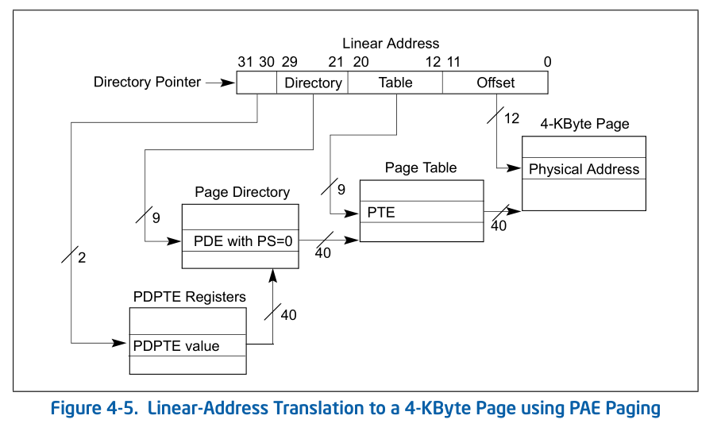
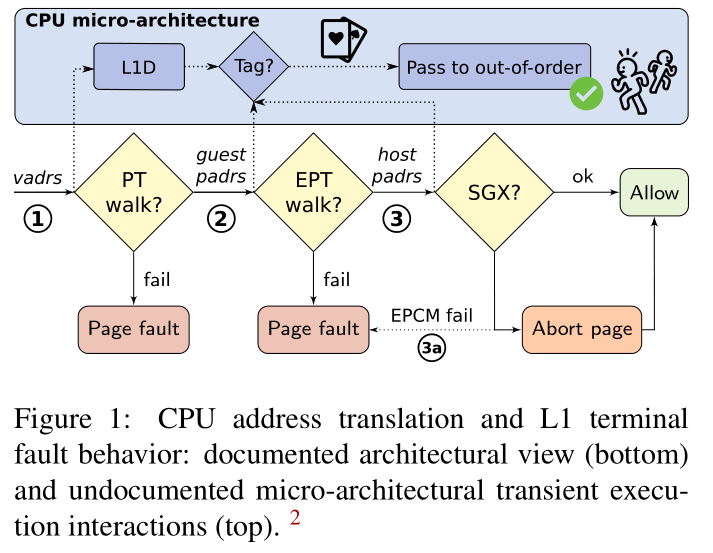

# [Foreshadow](https://foreshadowattack.eu/)

* [Foreshadow paper](https://foreshadowattack.eu/foreshadow.pdf)
* [Foreshadow-NG](https://foreshadowattack.eu/foreshadow-NG.pdf)
* [L1 terminal fault(Intel)](https://www.intel.com/content/www/us/en/architecture-and-technology/l1tf.html)

## 経緯
* Bulckたちのチーム(少し遅れてTechnionのチームも)がSGXに関するForeshadowの脆弱性を見つけてIntelに報告
* Intelがそれを調べてSGX以外にも脆弱性があることを見つける(Foreshadow-NG)
* CPU, OS, 各種Vendorはほぼ対策済み

## 概要
* SGXはMeltdownやSpectreに対して強いと思われていたが攻撃できた
* Foreshadowを調べるとkernel, Hypervisor､他のVMなどに属するL1キャッシュにある任意のデータを読める可能性が見つかった

## 用語
* 線形アドレス(linear address) ; 論理アドレス(セグメントとオフセットの組)から算出されるアドレス ; いわゆる各プロセスでの仮想アドレス
* PAE(physical address extension) ; 物理アドレス拡張 ; 32bit環境で4GiBを越えるメモリ空間を扱う技術 / 64bit環境でも利用されている
* PDPTE(page directory pointer table entry)
    * ページマップ→PDPTE→ページディレクトリ(PDE)→ページテーブル(PTE)→物理メモリの順序で変換する


* SMM(System Management mode) システム管理モード ; BIOS/UEFIファームウェアのセキュアな部分で使われる特殊なモード
* SMRR(System Management Range Registers) ; システム管理範囲レジスタ / SMMメモリを保護する範囲レジスタ
* ページテーブルエントリの属性情報フラグ
    * present ; 物理メモリ上に存在している / なければページfault
    * user/supervisor ; アクセス許可/禁止など
* Intel VT(virtualization technology) 仮想化支援技術
    * 複数のOSを効率よく並列動作させるための技術
* EPT(extended page table)
    * ゲストOSを実行するときそのOS内で持っているページング機構を仮想化する必要がある
    * ゲストOS内で仮想アドレス→物理アドレスと変換されたアドレスはホストOS上では本物の物理アドレスではない
    * 64bitの通常の4段のページングの後にEPTを参照する
    * ゲストOSの物理アドレスからEPTPにセットされたページテーブルでホストOS上の物理アドレスへの変換が行われる

## SGX(software guard extensions)
### 概要
* 重要な秘密のコードをenclave(隔離領域)に分離
    * 物理メモリの一部がenclaveとして予約される(EPC:隔離領域ページキャッシュ)
    * EPCは暗号化される
* CPUのみ信頼
* enclaveはシステムと独立(OSからは読めない)

### アクセス制御
### 隔離領域から外部
* メモリアクセスはOS/VMMによるセグメントとページングのポリシーを満たさなければならない
* 隔離領域からそれらのポリシーの変更はできない
* 隔離領域から外部のリニアアドレスにfetchすると一般保護違反が発生

### 外部から隔離領域
* EPCへのアクセスはアボート
* 外部から隔離領域にマップするアドレスへのジャンプはアボート
* 正しく割り当てられた変換と異なるアドレス変換を利用したアクセスは一般保護違反が発生

### 命令
スーパーバイザ用
* ENCLS EADD ; ページ追加
* EBLOCK ; EPCをブロック
* ECREATE ; 隔離領域の作成
ほかにEDBGRD, EDBGWR, EEXTEND, EINIT, ELDB, ELDU, EPA, EREMOVE, ETRACK, EWBなど

ユーザ用
* ENCLU EENTER ; 隔離領域に入る
* EEXIT ; 隔離領域を出る
* EGETKEY ; 暗号化鍵の作成
* EREPORT ; 暗号レポートの作成 ; 隔離領域の属性, ハッシュ, 署名者など
* ERESUME ; 隔離領域に再度入る

## Foreshadow
* 攻撃者が4KiB x 256のバッファ(buffer)を用意する
* SGXの中で犠牲者のプログラムが秘密領域にアクセスして秘密のデータがL1Dに入る
* 秘密のページをnon-present(mprotect(PROT_NONE))にする
    * これで見えるのが今回の新しい知見
* 攻撃者が
```
mov al, [rsi] ; rsi = 秘密領域
shl rax, 12
mov rax, [rdx + rax] ; rdx = buffer
```
を実行する。
* `mov al, [rsi]`で例外が発生するが後続の命令が投機実行される
* bufferを読んで時間がかからないアドレス(al)を見つける

## Foreshadow-NG
* linearアドレスを物理アドレスに変換するときにはPT, EPT, SGXそれぞれのチェック機構が働く
* しかし該当アドレスがL1Dにあるとそれらを飛ばして投機実行されてしまうことがある


## [Deep Dive:Intel Analysis of L1 Terminal Fault](https://software.intel.com/security-software-guidance/insights/deep-dive-intel-analysis-l1-terminal-fault)

### アドレス変換
* linearアドレスにアクセスするときまずTLBの中で物理アドレスへの変換を探す
* もしmapされていないアドレスならメモリの階層的ページング構造を探して(table walk)物理アドレスに変換する
* table walkが失敗すればpage fault例外が起こる

### 脆弱性
* ページング構造エントリーが存在しない(Present=0)か予約ビットがセットされているときL1TFに対して脆弱
* 変換が完了しないのでそれらのエントリーに対してterminal faultが起こる
* アクセスは拒否されるけれども投機実行が起こる可能性がある

### 投機実行
* CPUがterminal faultを発生させる間にCPUはページング構造エントリーから物理アドレスを投機的に計算する
* この物理アドレスはページフレームのアドレスと仮想アドレスの下位ビットから生成される
* 生成された物理アドレスがL1Dに存在するならそのデータはreadされてそれに依存する命令にfowardされる可能性がある
* これらの依存する命令がサイドチャネル攻撃の対象となり得る
* それらの物理アドレスは本当の変換ではないのでいくつかのメモリ保護の対象外となる

特に

* SGXのメモリ保護チェックが適用されない
* EPT(extended page table) ゲストの物理アドレスからホストの物理アドレスへの変換が適用されない
* SMM(system management mode)のメモリ保護チェックが適用されない

### L1TFアドレス計算の詳細
* L1Dを探すために使われる物理アドレスは例外が発生したページング構造のレベルとそのページング構造の中身に依存する。
* page size(PS)がセットされているページング構造階層のレベルでtable walkが完了した場合、
L1Dを読むためのアドレスはレベルに応じて異なるビットを消費する。

### 例
物理アドレス0x1000を参照するread onlyなページがswap outによりアクセスできなくなったときOSはpresent bit(P)を0にする。
このときL1TFが可能だった。

## E2E(enclave to enclave); enclave = 隔離領域
E2E法はL1TFの変種。E2EはSGXの中のあるメモリを、同じコアで動いている異なるSGXのプログラムに暴露する。

* SGXの中でELRANGEの中のlinearアドレスにアクセスするとCPUはそのアドレスを通常の変換機構で変換する。
* CPUはその物理アドレスが保護された隔離領域ページキャッシュ(EPC:enclave page cache)の中にあることを確認する。
* 隔離領域がこの物理アドレスにアクセスしてよいことをEPCM(EPC map)を見て確認する。

* EPCMのチェックがアクセス保護違反を示せば操作は許可されずpage faultになる。
* しかし禁止されたアクセスがloadで物理アドレスがL1Dに存在すれば、それに依存する操作が投機的に実行されて、その結果を観察できるかもしれない。

* SGXに属する物理ページが別の隔離領域のELRANGEの中にマップされていれば、2個目の隔離領域はE2Eを使うことでそのデータを推測できるかもしれない。
* E2EはL1TFのサブセットなのでL1Dにあるlineのみが漏洩する可能性がある。
* L1TFと違って前の命令が解決する前にE2E probeが投機的に起こる可能性がある。

### SMM
* SMRR MSRによってSMMを保護する。
    * non-SMMコードがSMM lineをL1Dに持ち込ませないようにする。
* L1D_FLUSHをenumerateし、L1TFの影響を受けるCPUはSMMを終了するRSM命令中にL1Dを自動的にフラッシュする。
    * RSM ; SMMからアプリケーションプログラムに制御を戻す命令
* SMMソフトウェアは全ての論理CPUがSMMに入ったり出たりするときに次のことをしている。
    * きょうだい位置にある論理CPUがflushされたあとL1Dを自動的にreloadしない。
    * この場合non-SMMソフトウェアがSMMに属するlineがL1Dに存在する間に実行されることはない。
    * そういう実装をしているとL1TF対策コードは不要。