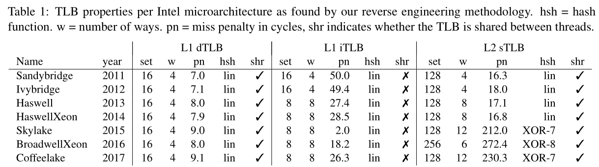
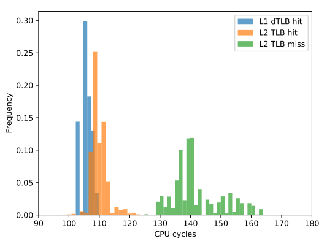
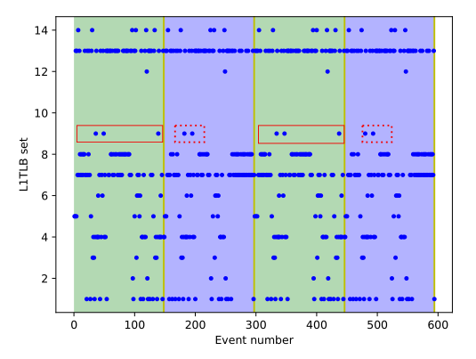
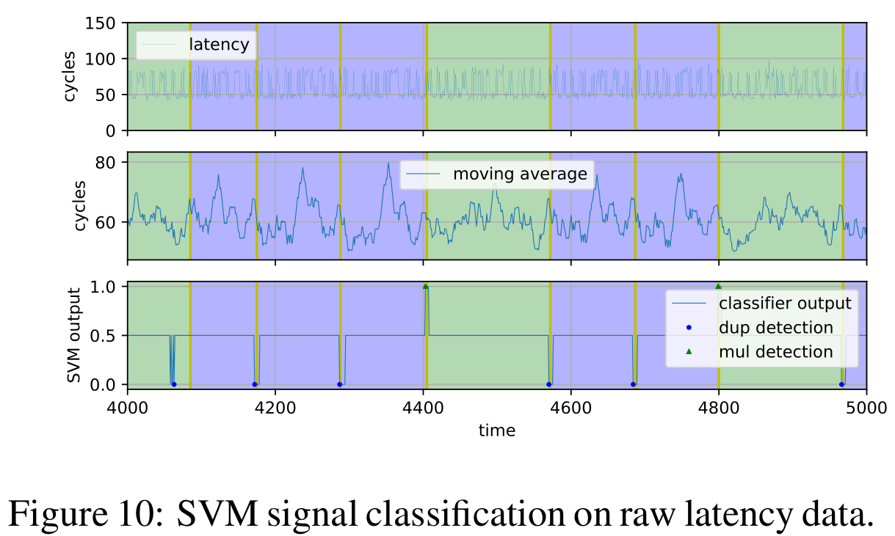

# [TLBleed](https://www.vusec.net/projects/tlbleed/)

* 画像は全て[Translation Leak-aside Buffer: Defeating Cache Side-channel Protections with TLB Attacks](https://www.vusec.net/download/?t=papers/tlbleed_sec18.pdf)からの引用


# 概要
TLBの性質を解析し、EdDSAなどの秘密鍵を盗む実証実験をした

# 用語
## 物理アドレス
メインメモリ(RAM)にアクセスするためのメモリアドレス

## 仮想アドレス
OSがプロセスごとに与える概念上のアドレス

## メモリアクセス
* プログラムがメモリにアクセスするときは仮想アドレスを指定する。
* OSが仮想アドレスを物理アドレスに変換して本当のメモリの指す場所を特定する。

## ページテーブル
どの仮想アドレスがどの物理アドレスに対応しているかの一覧

## TLB(Translation Lookaside Buffer)
* 仮想アドレスから物理アドレスへの変換を高速化するためのバッファ
    * OSはまずTLBを参照し、そのアドレスがTLBにあれば(TLBヒット)それを利用する
    * なければ(TLBミス)ページテーブルを利用する
    * 参照の際にはメモリの一部をkeyとする連想メモリ(CAM)が使われることが多い

## CPUのキャッシュ
* キャッシュは実際にメモリにアクセスするときの高速なバッファ
* キャッシュにデータが存在していたとしてもTLBミスの場合はページテーブルを参照する必要がある
* キャッシュエビクション(eviction)
    * 不要なデータをキャッシュから追い出すこと


## 多層TLB
小さいが高速なもの、大きいが低速なもの、コードとデータを分離するものなど複雑な構造を持つ

# Intelの用語
最近は一つのマシンで複数のVMを扱うことが多い

## RDT(Resource Director Technology)
OSがメモリやキャッシュの状況をモニタリングして管理する

* VMはLCC(ラストレベルキャッシュ:L3キャッシュ)を共有する
* 一つのVMがキャッシュを占拠すると他のVMの性能低下を招く

## MBM(Memory Bandwidth Monitoring)
メモリの使い方をモニタリング

### CDP(Code and Data Prioritization)
LLCでコードとデータの配置や優先順位を制御する

## CMT(Cache Monitoring Technology)
キャッシュの状況をモニタリング

### CAT(Cache Allocation Technology)
* LLCの利用を管理制限する
* セキュアな領域へのアクセスを禁止したりできる

# IntelのTLBの基本
## 第一レベル
* L1iTLB ; コード用TLB
* L1dTLB ; データ用TLB

## 第2レベル
* L2sTLB ; コード・データ用の共用TLB

# 盗聴モデル
* 攻撃対象マシンで非特権コードを実行できる
* 攻撃対象コードの共有されたTLBの状態をモニタリングする
* HT(hyperthreading)ありで攻撃対象とコアを共有する
* キャッシュパーティションによって攻撃者と隔離されていてもOK

Q1. どうやってTLBセットをモニタするのか。
どうやって仮想アドレスを多層TLBにマップするのか。

Q2. どうやってHTはTLBセットを共有するのか。

Q3. どうやって非特権コードがTLBの活動をモニタするのか。

Q4. 攻撃者は4KiBページ粒度を意味のある攻撃につなげられるのか。

# TLBモニタリング
* 仮想アドレスをTLBにマッピングする方法をリバースエンジニアリングで調べた。
* Linuxのperfコマンドのdtlb_load_misses.stlb_hitやdtlb_load_misses.miss_causes_a_walkイベントを利用。

## 線形写像TLB
最初TLBが線形であると仮定してパラメータを見つけようとしたがうまくいかなかった。
* target_set = parge_va mod s ; sは集合の要素数

TLBのキャッシュエビクション(eviction)を探すためにアドレスをs pageだけずらしながらアクセスする
* broadwellは4-way 16-set L1 dTLBだと分かった

## 複雑な階層のTLB
次にL2 sTLBについて考える
* SkylakeのL2 sTLBは線形ではなく特定のビットをxorするアルゴリズムを利用していることが分かった


## TLBキャッシュ間の相互作用
キャッシュが包括的(inclusive)か
* inclusive ; ある階層にキャッシュがあればそれより上位にも含まれる
* not inclusive ; 高々一つの階層にキャッシュが存在する

実験からSkylakeのTLBはnot inclusiveと分かった

## hyperthread(HT)間のTLBモニタリング
* TLBのeviction setを集める
* あるスレッドでそれにアクセスし, 同時にもう一つのHTで同じsetにアクセスする

実験からSkylakeではL1 dTLBとL2 sTLBが共有されることが分かった

これらのTLBを攻撃可能と考えた

## 非特権でのTLBモニタリング
4-way TLBをモニタリングする

```
mov (rax), rax
mov (rax), rax
mov (rax), rax
mov (rax), rax
```
にかかる時間を測定する



* L1 dTLBに完全に入るもの
* 一部L1ミスするがL2には入っているもの
* L2より大きいもの
これらを同じ物理アドレスにマップされる仮想アドレスに配置する

## 一時解析
* libcryptのECCスカラー乗算コード(constant-time版)をターゲットにする
    * 通常EdDSAはnon-constantアルゴリズム
    * サイドチャネル攻撃に対して脆弱と言われるconstant-time版を使っていることに注意

### 秘密鍵でスカラー乗算する部分

```
# input y, secKey
x = 0
for i in secKey:
  x = x * 2
  # secKeyのbitが立っているときだけ乗算するのでnon-const版
  # bitに関わらず常にyを掛ける(結果は捨てる)とconst版
  if i:
    x = x * y
```
mulが呼ばれてるかどうかでsecKeyのbitが分かる



* 薄い緑(mul)と薄い青(dup)の領域は2個の異なる関数を示す
* もしこの2個の関数を区別できれば秘密鍵を取得できる

実際にHTの片方でlibcryptを動かし、もう一つのHTでレイテンシを観測する

* 既知の情報と観測情報をSVM(support vector machine)を使って分類器(0:dup, 1:mul)を作る
* SVM ; 教師ありの2値分類器

## ターゲットTLBの特定
* 上記学習では単一のTLBを学習に使った
* 実際にはその情報はASLRによりランダム化されて事前に得られない

## TLB setの特定
* 16個のL1 dTLBの中からターゲットのTLBを特定する分類器を作った
* その結果F1値0.54で区別できた

## cf. [CacheBleed](https://www.cis.upenn.edu/~danielg3/cachebleed/) : [a timing attack on OpenSSL constant-time RSA](https://eprint.iacr.org/2016/224)

cache-basedタイミング攻撃を防ぐためのscatter-gatherテクニックがconst-timeではないことを示し、
OpenSSL 1.0.2fのRSAに対して実際に攻撃する。
16000個の復号を観察することで4096-bitRSAを攻撃できた。

## Intel CATへの疑問
CATを有効にしてもTLBeeldは有効だった

## TLBeeldの緩和
HTを止める

* Intelの見解 [hothardware](https://hothardware.com/news/intel-no-plans-patch-tlbleed-hyper-threading-cpu-exploit)

*TLBleed uses the Translation Lookaside Buffer (TLB), a cache common to many high performance microprocessors that stores recent address translations from virtual memory to physical memory. Software or software libraries such as Intel® Integrated Performance Primitives Cryptography version U3.1 - written to ensure constant execution time and data independent cache traces should be immune to TLBleed.*

* OpenBSDはHTを[disable](https://www.mail-archive.com/source-changes@openbsd.org/msg99141.html)
