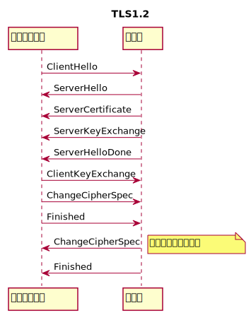
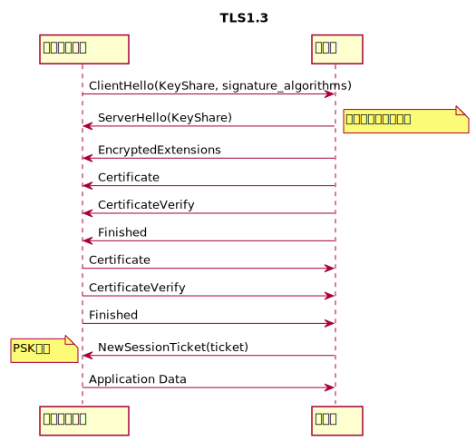
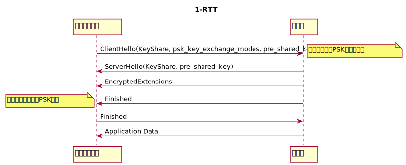
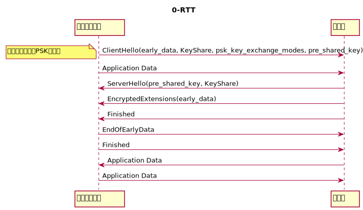
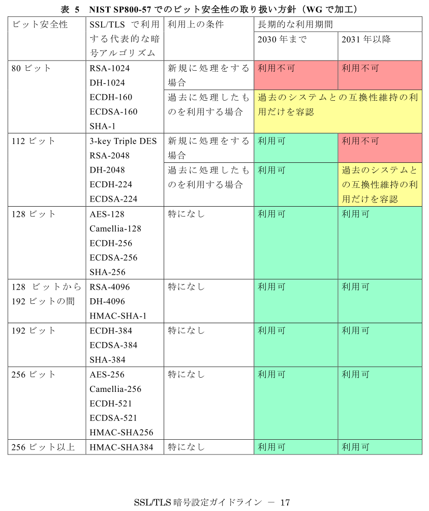

# SSL/TLS暗号設定ガイドライン 第2.0版

* [PDF](https://www.cryptrec.go.jp/topics/cryptrec_20180508_gl_3001_2.0.html)
* [「SSL/TLS暗号設定ガイドライン 第2.0版」を読んで](https://jovi0608.hatenablog.com/entry/2018/05/09/213703)

# TLS1.3の概要
* [The Transport Layer Security (TLS) Protocol Version 1.3](https://tools.ietf.org/html/draft-ietf-tls-tls13-28)
* triple DES, DSA, RC4, MD5, SHA-1, SHA-224, FSの無い静的なRSA, AESのCBCモードが削除
* ChaCha20, EdDSAが追加された
* 鍵交換はECDHE, 楕円曲線はsecp256r1, ハッシュ関数はSHA-256が必須となった
* リネゴシエーション, 圧縮, セッション回復が削除された
* HMACベースの鍵導出が再設計された
* 性能向上のための1-RTTや0-RTT(接続の再開:リプレイ攻撃に注意)が追加された

```
EalySecret(ES) = HKDF-Extract(PSK, 0) # 初期状態ではPSK = 0
｜  // 0-RTTのClientの最初のApplication DataとEndOfEarlyDataで使う
｜  client_early_traffic_secret = HKDF-Expand(ES, ...)
｜  early_exporter_master_secret = HKDF_Expand(ES, ...)
｜  binder_key = HKDF_Expand(ES, ...)
↓
x = HKDF_Expand(ES, ...)
HandshakeScret(HS) = HKDF_Extract((EC)DHE, x)
｜  // EncryptedExtensionsからFinishedの間で使う
｜  client_handshake_traffic_secret = HKDF_Expand(HS, ...)
｜  server_handshake_traffic_secret = HKDF_Expand(HS, ..)
↓
MasterSecret(MS) = HKDF_Extract(0, x)
    // NewSessionTicketやApplication Dataの暗号化に使う
    client_application_traffic_secret_0 = HKDF_Expand(MS, ...)
    server_application_traffic_secret_0 = HKDF_Expand(MS, ...)
    exporter_master_secret = HKDF_Expand(MS, ...)
    resumption_master_secret = HKDF_Expand(MS, ...)
```






# TLSプロトコルの動向
NIST [SP 800-52 Rev. 2 (DRAFT) ](https://csrc.nist.gov/publications/detail/sp/800-52/rev-2/draft); 2020年1月1日までに全てのサーバとブラウザが
* TLS1.2サポートを要求
    * should not be configured to use TLS1.1
    * shall not use TLS1.0, SSL3.0, SSL2.0
* TLS1.3サポートの計画を作るよう勧告

# CRYPTREC暗号リスト
[政府機関の情報セキュリティ対策のための統一基準](http://www.cryptrec.go.jp/list.html)

NIST SP800-57でのビット安全性の取り扱い方針(p.18)



# 要求設定の概要
## 鍵交換
* 高セキュリティ型
    * 鍵長2048ビット以上のDHE or 256ビット以上のECDHE
* 推奨セキュリティ型
    * 鍵長1024ビット以上のDHE or 256ビット以上のECDHE
    * 2048ビット以上のRSA 256ビット以上のECDH
## 暗号化
* 鍵長128/256ビットのAES or Camellia
## 証明書鍵長
* 2048ビット以上のRSA or 256ビット以上のECDSA


## コメント
* ECDSAはいずれも256ビット以上
    * [TLS 1.3](https://tools.ietf.org/html/draft-ietf-tls-tls13-28#appendix-C.2)
    2048ビットRSA, 224ビットECDSAより弱いものは適切ではない
    * 2048ビットRSAは206ビットEC程度という研究もある(つりあってない)
    * p.35にはRSA2048の計算量見積もり10^25～10^27FLOPS, ECDSA192ビット10^24～10^25FLOPS
* 現時点で[EdDSA](https://tools.ietf.org/html/rfc8032)などは入っていない

# [「SSL/TLS暗号設定ガイドライン改訂及び鍵管理ガイドライン作成のための調査・検討」報告書の公開](https://www.ipa.go.jp/security/fy30/reports/crypto_survey/index.html)

各国の推奨暗号スイート、ブラウザ対応状況など
