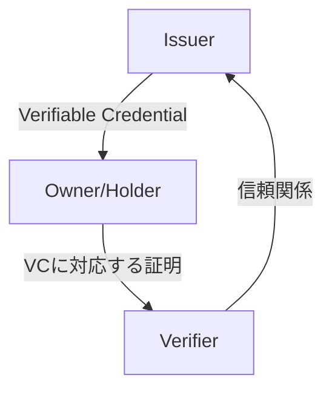

# 検証可能な識別情報(Verifiable Credential)

## 自己主権型ID(SSI : Self-Sovereign Identity)

自分が自分であることを示す情報(名前, メールアドレス, 各種サービスのID, etc.)
- 殆どの場合管理しているのは巨大企業か政府
  - 個人情報が一カ所に集中する
  - 突然のアカウント停止のリスク
- それらを自分の手で管理したい
  - 自分のIDの提供範囲や有効期限の制御

- 中央集権的なID管理(ex. 政府による管理)
  - IDは単一の発生源から提供される
- Multi-Source Identity
  - 複数のプロバイダがIDを提供する

[Verifiable Credentials Data Model v1.1](https://www.w3.org/TR/vc-data-model/)
