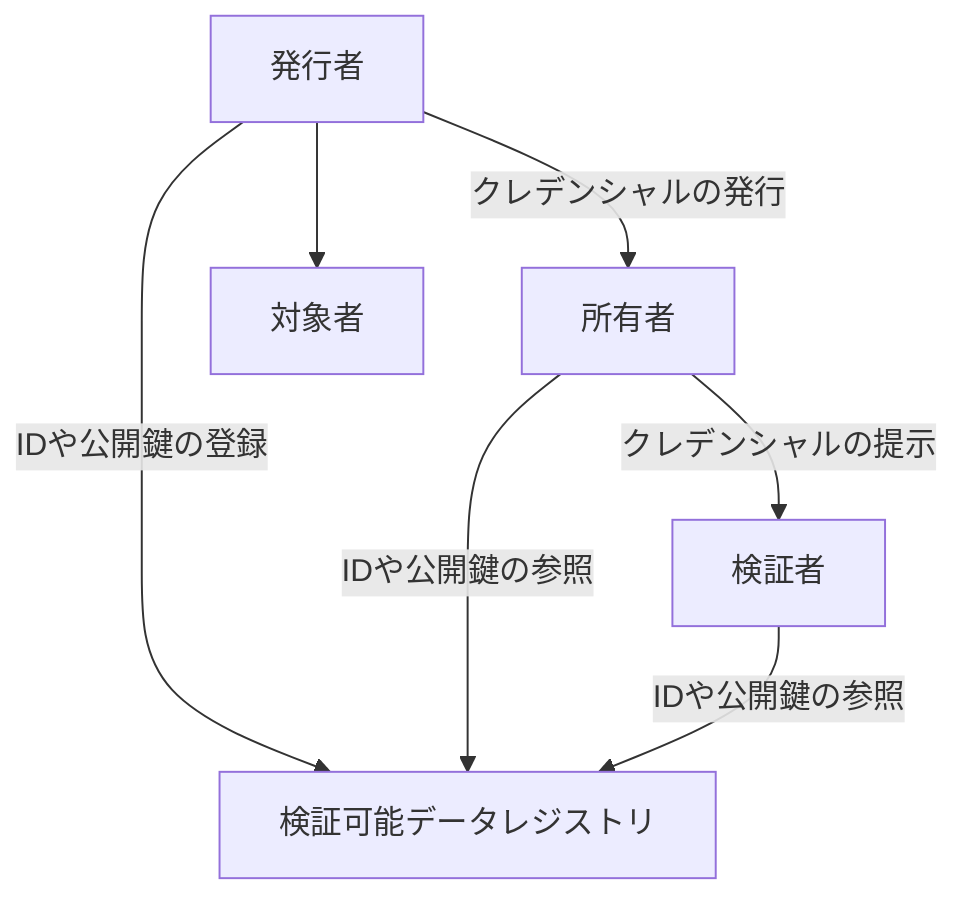

# 検証可能なクレデンシャル(Verifiable Credential)

## デジタルアイデンティティ
自分が自分であることを示す情報(名前, メールアドレス, 各種サービスのID, etc.)

- 殆どの場合管理しているのは企業か政府
  - 個人情報が一カ所に集中する
  - 恣意的なアカウント停止のリスク
    - 個人事業主が突然ブロックされて困った話
    - [ロシカからのアクセス遮断を拒否](https://github.com/github-community/community/discussions/12042)
    - [GitHubがロシアのアカウントをブロック](https://www.gizchina.com/2022/04/17/github-accounts-in-russia-blocked-no-one-can-resist-sanctions/)

- それらを自分の手で管理したい
  - 自己主権型アイデンティティ(SSI : Self-Sovereign Identity)
  - 自分のIDの提供範囲や有効期限の制御

## IDとクレデンシャルの管理
- ID
  - デジタル世界でのエンティティ(実体 : 登場人物・組織)を識別するための情報・識別子
  - リアル世界での一人に複数のIDが割り当てられることが多い
- レルム
  - IDが有効で識別可能な範囲
- デジタルアイデンティティ
  - IDに紐づけられた情報(名前 住所 写真など)

- 認証
  - デジタル世界でそのエンティティであることを第三者に認識してもらう
  - 認証により特定のリソースにアクセス・操作できる

- トークン
  - そのIDが割り当てられたエンティティが持つ秘密情報
- クレデンシャル[credential](https://www.w3.org/TR/vc-data-model/#dfn-credential)
  - IDに紐づけられた属性情報
  - 暗号技術により完全性が保証される
    - VC : デジタル化された情報を機械的に検証できるもの
  - その内容自体が信用に足るかは別の話
  - 認証する人はクレデンシャルにある属性情報を確認して認可することもある
    - ex. TLSクライアント証明書による認証

- スマートコントラクト
  - 電子契約の締結とサービスの実行を自動的に行う方式
    - 自動販売機にお金を入れる
    - ボタンを押すとジュースが出てくる
      - このプロセスがある条件の下で自動的に行われる
- Ethereum ERC-735
  - ID = Ethereumアドレス
  - レルム = Ethereumブロックチェーン
  - Claim = クレデンシャル
    - 秘密鍵を用いてブロックチェーン上に発行できる
  - どうやってClaim発行者を信頼してClaimの価値判断をするか

- 中央集権的なID管理(ex. 政府による管理)
  - IDは単一の発生源から提供される
- ID連携(Federation)
  - レルムを越えて認証する
  - ID連携による別のサービスへのログイン
    - 一つのIDが使えなくなると連鎖して複数のサービスが使えなくなる可能性
- 非中央集権型識別子(DIDs : Decentralized Identifiers)
  - 特定のレルムだけで有効なIDではない
  - 一括管理するものではない

- [Self-Issued OpenID Provider](https://openid-foundation-japan.github.io/openid-connect-core-1_0.ja.html#SelfIssued)
  - OpenIDの一機能
  - 自分自身がOpenID Providerになる
    - 自分で鍵ペアを生成して端末に保存する
    - 自分でID Tokenを発行する(自己署名)
    - そのIDは自分で管理する

[ID2020 Technical Requirements: V1.0](https://docs.google.com/document/d/1L0RhDq98xj4ieh5CuN-P3XerK6umKRTPWMS8Ckz6_J8/edit)
- 物理的んオフラインでもオンラインでも有用である
- 過酷な環境でも使える
- IDのライフサイクル全体を通してコスパがよい
- エンドユーザが簡単に使えてユーザ教育は最小限
- RP(Replying Party)が実装しやすい
- ...

## VCの利用シーン(理想)
- AさんはXに住んでいる
- サービスBを利用したい
  - BはXに住んでいる人に割引サービス
  - AはBに対してXに住んでいることを示したい
- AはXに住民票の発行依頼
  - XはAの本人確認をする
  - XはAにVCを発行する
- AはBにそのVCを提示する
  - VCは住所だけでなく年齢や家族構成も含むかもしれない
  - Xに住んでいることだけを提示したい

- 発行者(Issuer)
  - VCを発行するエンティティ
- 所有者(Holder)
  - 発行されたVCを保持するエンティティ
- 対象者(Subject)
  - VCによって主張されるクレデンシャルのエンティティ
- 検証者(Verifier)
  - VCを検証して利用するエンティティ
- 検証可能データレジストリ(Verifiable Data Registry)
  - だれでも参照可能
  - 書き換え不可能
  - 秘密にしたい個人情報を置くのは不適切

従来のデジタル証明書との違い
- 提示するデータを最小限にできる仕組み
- 所有者がVCを持つ

- [VCI : Vaccination Credential Initiative（](https://vaccinationcredential.org/)
  - ワクチン証明書のデジタル化
- [Digital Identity for all Europeans](https://ec.europa.eu/info/strategy/priorities-2019-2024/europe-fit-digital-age/european-digital-identity_en)
  - EU市民・居住者・企業が本人確認や特定の個人情報の確認をするための仕組み
  - オンライン・オフラインで利用できる
  - 公共・民間サービスに利用できる
- [Trusted Web 推進協議会](https://www.kantei.go.jp/jp/singi/digitalmarket/trusted_web/pdf/documents_210331-2.pdf)
  - ユーザがデータへのアクセスを制御できる
  - 相手やデータに関する信頼を検証できる
  - 双方の意志を反映した動的な合意形成
  - その後の履行状況を検証できる
  - 特定のサービスに依存せずにデータ制御や合意形成をする仕組みを取り入れる

## [JSON-LD](https://json-ld.org/)
- Linked DataをJSONを使って表現する
- 人間が読み書きしやすい
- JSONフォーマットなのでコンピュータでも読み書きしやすい

クレデンシャルをJSON-LDで扱う

## [BBS+署名](https://w3c-ccg.github.io/ldp-bbs2020/)
- [実装1](https://github.com/mattrglobal/bbs-signatures)
- [実装2](https://github.com/decentralized-identity/bbs-signature)
- グループ署名の一種
- 複数のデータを並べたもの(リスト)に署名をつけられる
- ゼロ知識証明(ZKP)と組み合わせやすい
  - 署名したデータのリストの一部を隠したまま署名の検証ができる
  - 特定の要素を隠したまま、それがある条件を満たすことを検証できる(まだ)

## 参考

- [Internet Infrastructure Review Vol. 43](https://www.iij.ad.jp/dev/report/iir/043.html)
- [Internet Infrastructure Review Vol. 52](https://www.iij.ad.jp/dev/report/iir/052.html)
- [Verifiable Credentials Data Model v1.1](https://www.w3.org/TR/vc-data-model/)

[Web3と国家戦略～基礎編～](https://note.com/masamasujima1976/n/n850a490d55b7)
- Web3にたずさわるまともな事業者は、日本居住者だけで事業を開始することはない
- 会計の取扱いと合致しないなどいうことを理由に、トークンの期末時価評価課税の例外は発行体にのみ認めるなどととぼけた議論をしている暇はありません。
